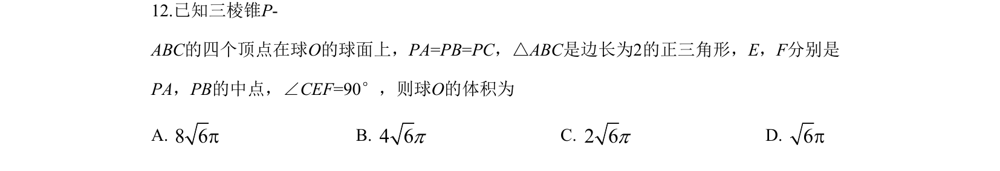
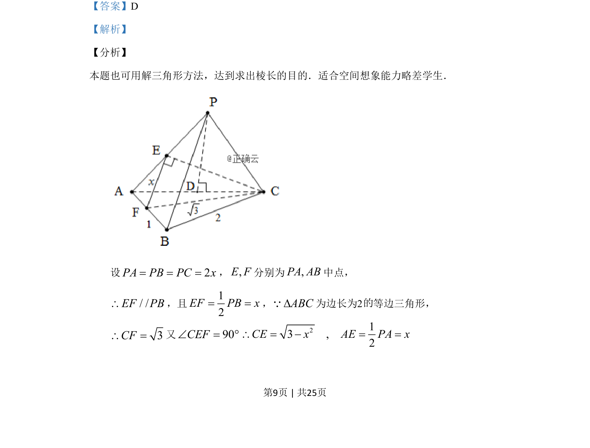
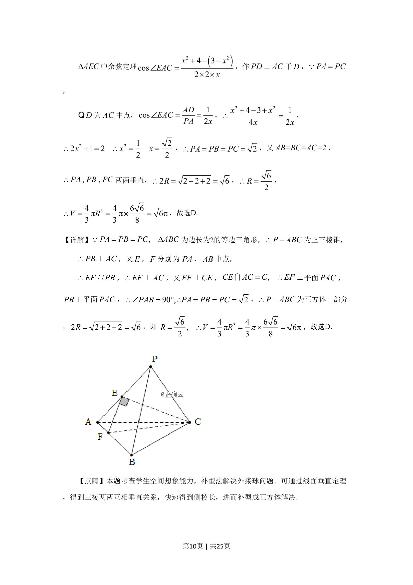

## 题面

## 摘要

立体几何中通过解三角形求棱长，进而利用垂直关系求三棱锥外接球半径。

## 关联考点

- [[589-解三角形|解三角形]]
- [[126-定理|余弦定理]]
- [[空间向量位置关系]]
- [[外接球]]

## 答案与解析

> 📄 原 PDF 第 9 页：`素材/真题/湖南/2008-2024·（湖南）数学高考真题/2019年高考数学试卷（理）（新课标Ⅰ）（解析卷）.pdf`
