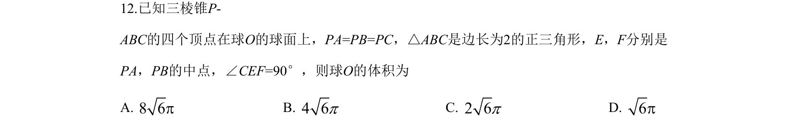
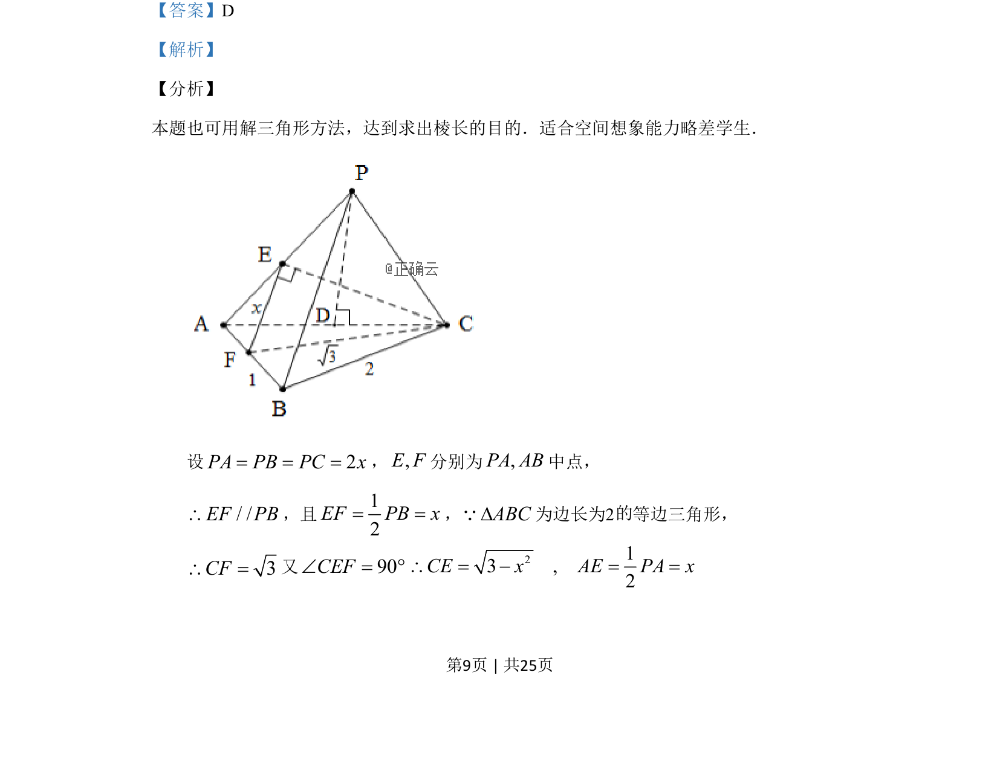
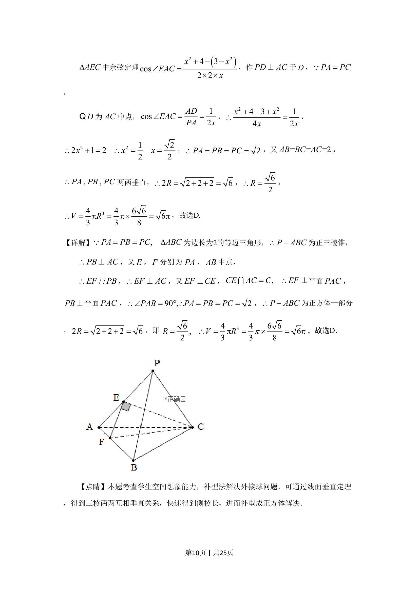

## 题面

## 摘要

立体几何中通过解三角形求棱长，进而利用垂直关系求三棱锥外接球半径。

## 关联考点

- [[589-解三角形|解三角形]]
- [[126-定理|余弦定理]]
- [[空间向量位置关系]]
- [[外接球]]

## 答案与解析

> 📄 原 PDF 第 9 页：`素材/真题/湖南/2008-2024·（湖南）数学高考真题/2019年高考数学试卷（理）（新课标Ⅰ）（解析卷）.pdf`

<!-- 题干文本-start -->
## 题干文本
12.已知三棱锥P-
ABC的四个顶点在球O的球面上，PA=PB=PC，△ABC是边长为2的正三角形，E，F分别是
PA，PB的中点，∠CEF=90°，则球O的体积为
A. 8 6πB. 4 6πC. 2 6πD. 6π
<!-- 题干文本-end -->

<!-- 解析文本-start -->
## 解析文本
【答案】D
【解析】
【分析】
本题也可用解三角形方法，达到求出棱长的目的．适合空间想象能力略差学生．
设 2PA PB PC x= = =，,E F分别为,PA AB中点，
/ /EF PB\，且12EF PB x= =，ABCDQ为边长为2 等边三角形，
3CF\ =又90CEFÐ = °213 ,2CE x AE PA x\ = - = =
的
<!-- 解析文本-end -->
