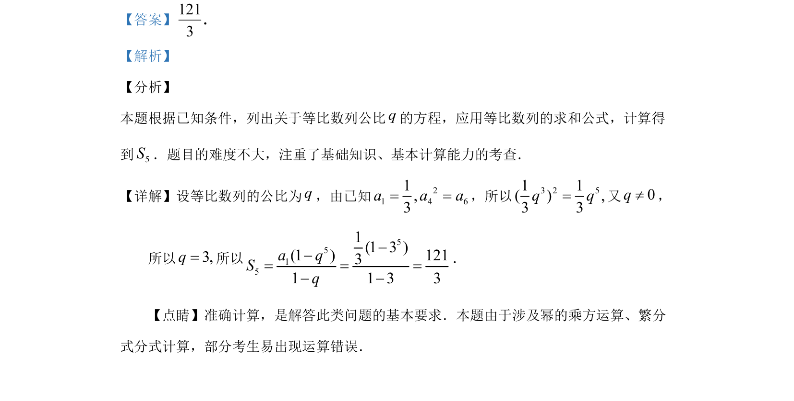

## 题面

## 摘要

已知等比数列条件，列出方程求公比，再利用求和公式计算前5项和。

## 关联考点

- [[1067-等比数列的定义与通项公式|等比数列]]
- [[384-数列通项公式|通项公式]]
- [[972-求和公式|求和公式]]
- [[061-方程|解方程]]

## 答案与解析

> 📄 原 PDF 第 11 页：`素材/真题/湖南/2008-2024·（湖南）数学高考真题/2019年高考数学试卷（理）（新课标Ⅰ）（解析卷）.pdf`
