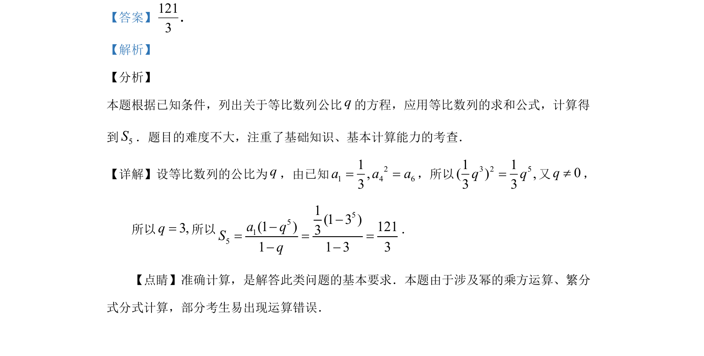

## 题面

## 摘要

已知等比数列条件，列出方程求公比，再利用求和公式计算前5项和。

## 关联考点

- [[1067-等比数列的定义与通项公式|等比数列]]
- [[384-数列通项公式|通项公式]]
- [[972-求和公式|求和公式]]
- [[061-方程|解方程]]

## 答案与解析

> 📄 原 PDF 第 11 页：`素材/真题/湖南/2008-2024·（湖南）数学高考真题/2019年高考数学试卷（理）（新课标Ⅰ）（解析卷）.pdf`

<!-- 题干文本-start -->
## 题干文本
14.记Sn为等比数列{an}的前n项和．若 21 4 613a a a= =，，则S5=____________．
<!-- 题干文本-end -->

<!-- 解析文本-start -->
## 解析文本
【答案】1213
.
【解析】
【分析】
本题根据已知条件，列出关于等比数列公比q的方程，应用等比数列的求和公式，计算得
到5S．题目的难度不大，注重了基础知识、基本计算能力的考查．
【详解】设等比数列的公比为q，由已知 21 4 61,3a a a= =，所以3 2 51 1( ) ,3 3q q=又0q¹，
所以3,q=所以
55151(1 3 )(1 )12131 1 3 3a qSq--= = =- -
．
【点睛】准确计算，是解答此类问题的基本要求．本题由于涉及幂的乘方运算、繁分
式分式计算，部分考生易出现运算错误．
<!-- 解析文本-end -->
