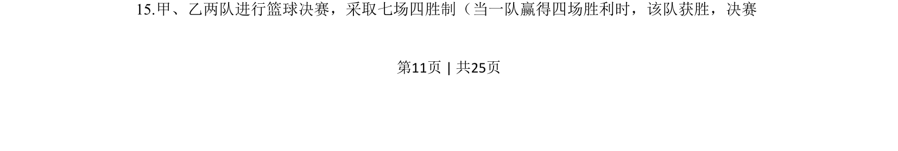
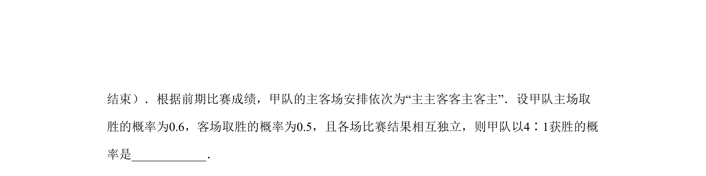
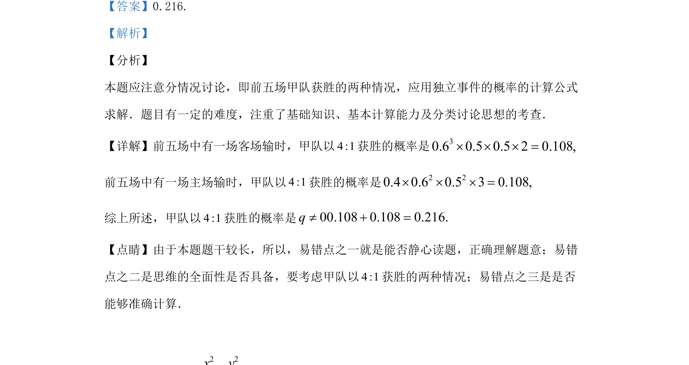

## 题面

## 摘要

1获胜的概率计算，需要分情况讨论前五场主场或客场输的情形，并应用独立事件概率公式。

## 关联考点

- [[独立事件概率]]
- [[424-参数分类讨论|分类讨论]]
- [[948-概率计算|概率计算]]

## 答案与解析

> 📄 原 PDF 第 11 页：`素材/真题/湖南/2008-2024·（湖南）数学高考真题/2019年高考数学试卷（理）（新课标Ⅰ）（解析卷）.pdf`
