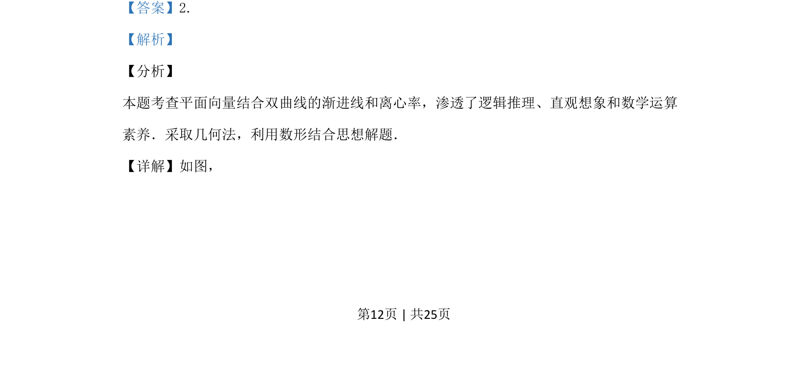
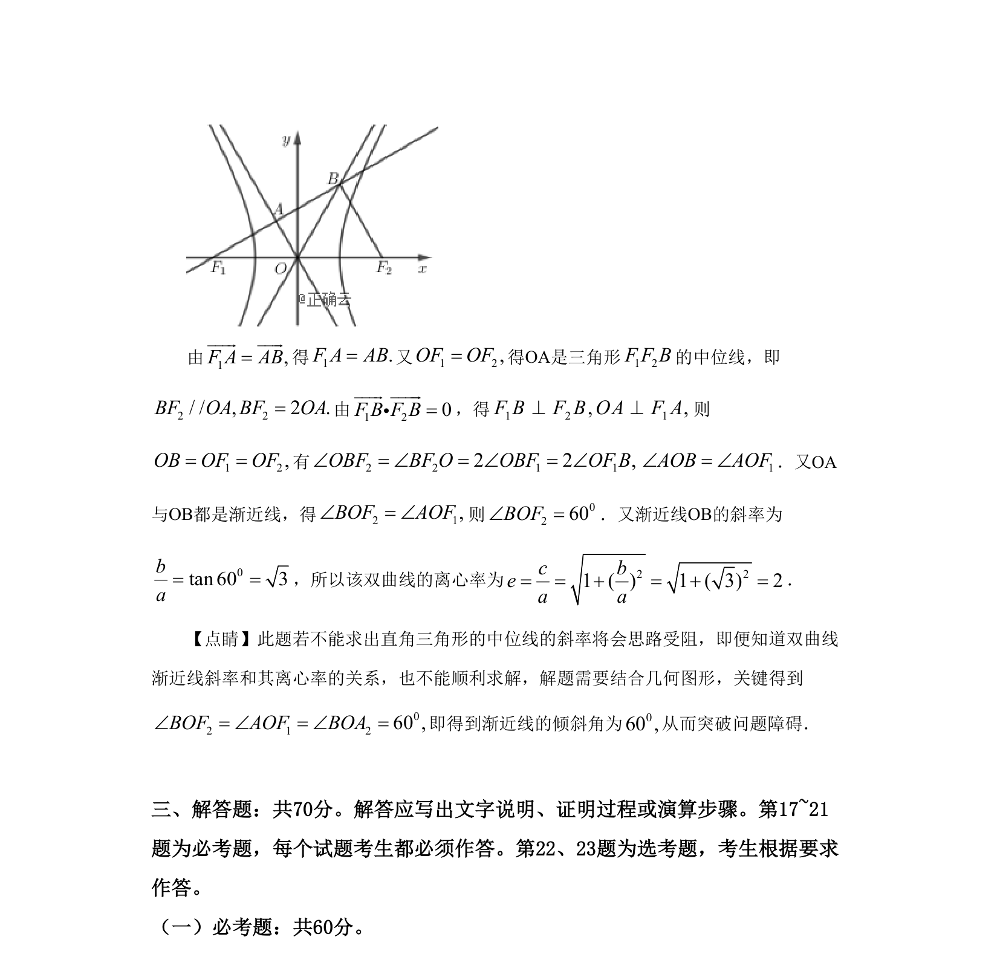

## 题面

## 摘要

本题通过平面向量与双曲线渐近线的几何关系，考查离心率的求解，涉及逻辑推理与数形结合。

## 关联考点

- [[1274-双曲线的几何性质|双曲线的几何性质]]
- [[平面向量应用]]
- [[391-椭圆离心率|离心率]]
- [[897-数形结合|数形结合]]

## 答案与解析

> 📄 原 PDF 第 12 页：`素材/真题/湖南/2008-2024·（湖南）数学高考真题/2019年高考数学试卷（理）（新课标Ⅰ）（解析卷）.pdf`
