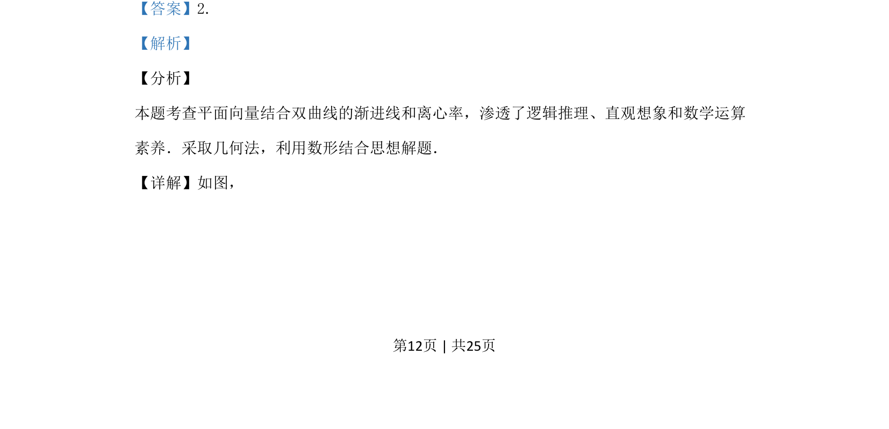
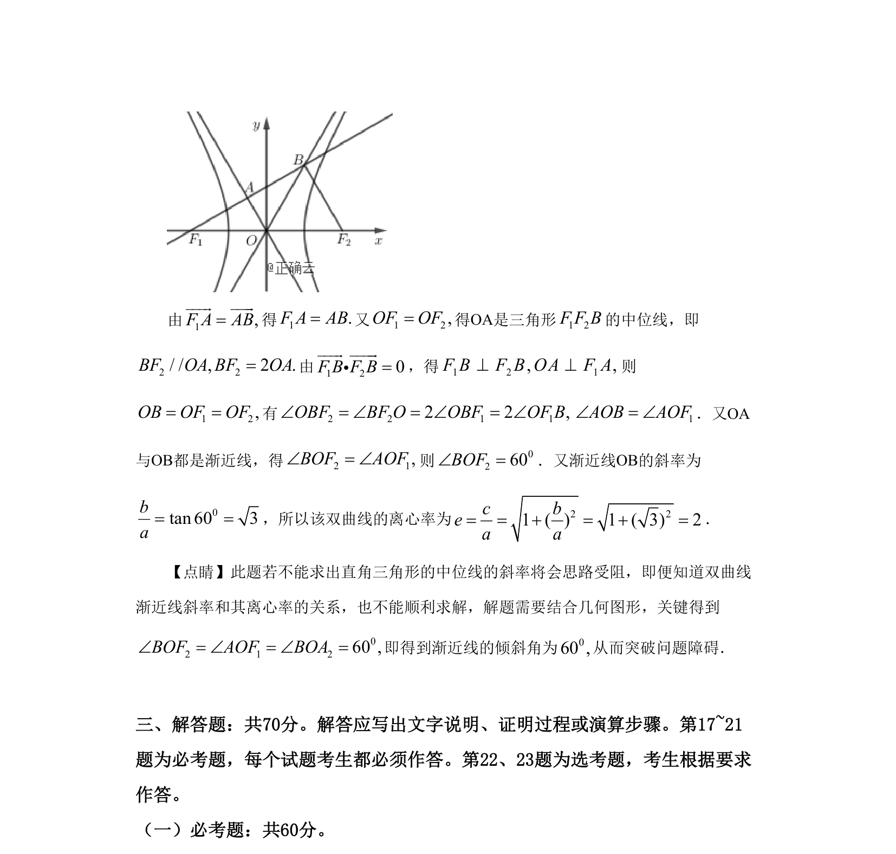

## 题面

## 摘要

本题通过平面向量与双曲线渐近线的几何关系，考查离心率的求解，涉及逻辑推理与数形结合。

## 关联考点

- [[367-双曲线几何性质|双曲线的几何性质]]
- [[平面向量应用]]
- [[391-椭圆离心率|离心率]]
- [[897-数形结合|数形结合]]

## 答案与解析

> 📄 原 PDF 第 12 页：`素材/真题/湖南/2008-2024·（湖南）数学高考真题/2019年高考数学试卷（理）（新课标Ⅰ）（解析卷）.pdf`

<!-- 题干文本-start -->
## 题干文本
16.已知双曲线C：
2 22 21 ( 0, 0)x ya ba b- = > >左、右焦点分别为F1，F2，过F1的直线与C的两
条渐近线分别交于A，B两点．若1F A AB=uuur uuu r
，1 20F B F B× =uuu r uuur
，则C的离心率为___________
_．
<!-- 题干文本-end -->

<!-- 解析文本-start -->
## 解析文本
【答案】2.
【解析】
【分析】
本题考查平面向量结合双曲线的渐进线和离心率，渗透了逻辑推理、直观想象和数学运算
素养．采取几何法，利用数形结合思想解题．
【详解】如图，
的的
<!-- 解析文本-end -->
