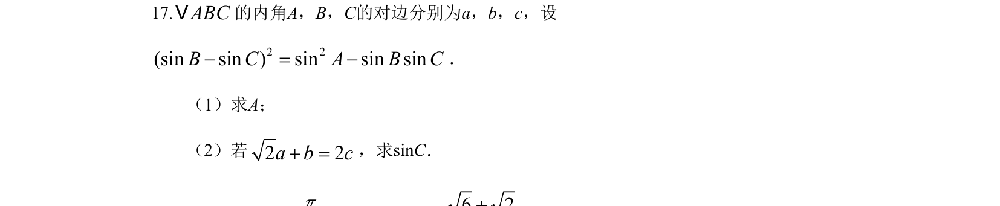
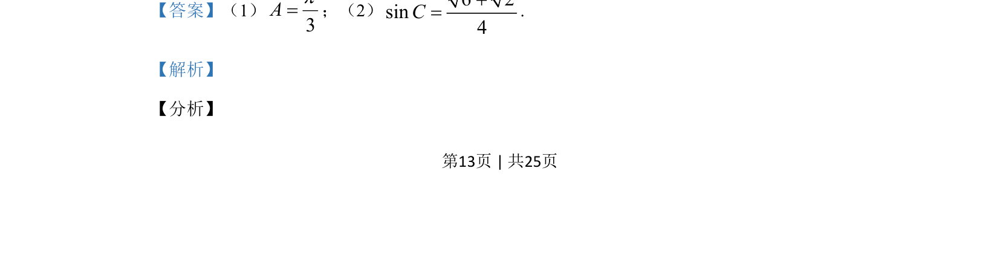
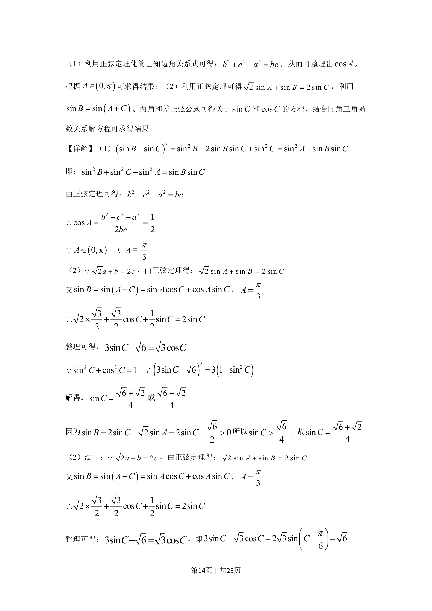
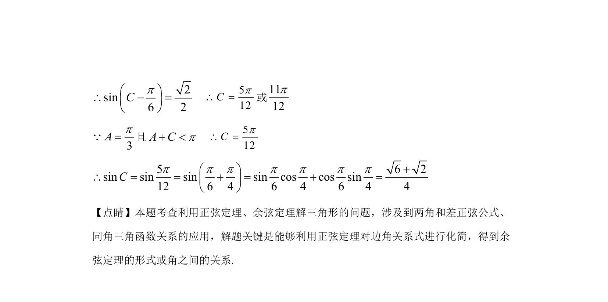

## 题面

## 摘要

利用正弦余弦定理及三角变换解三角形，求角与三角函数值。

## 关联考点

- [[126-定理|正弦定理]]
- [[126-定理|余弦定理]]
- [[1403-两角和差正弦公式|两角和差正弦公式]]
- [[293-同角三角函数关系|同角三角函数关系]]

## 答案与解析

> 📄 原 PDF 第 13 页：`素材/真题/湖南/2008-2024·（湖南）数学高考真题/2019年高考数学试卷（理）（新课标Ⅰ）（解析卷）.pdf`
