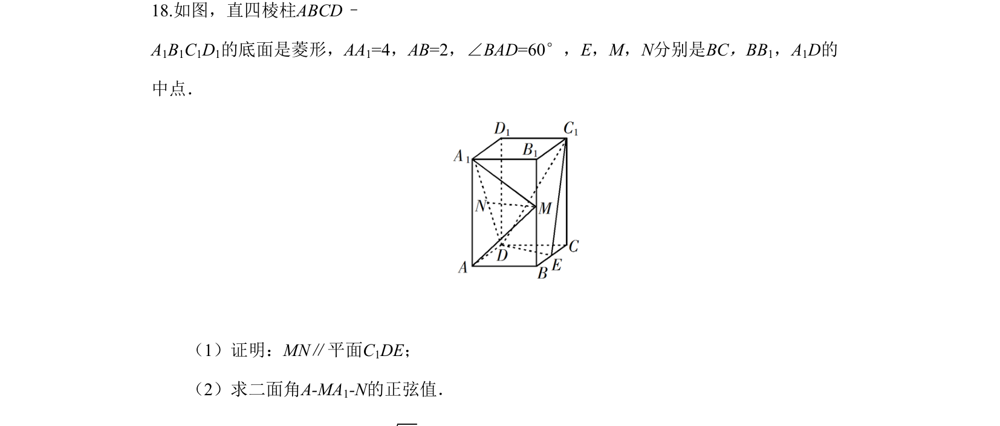
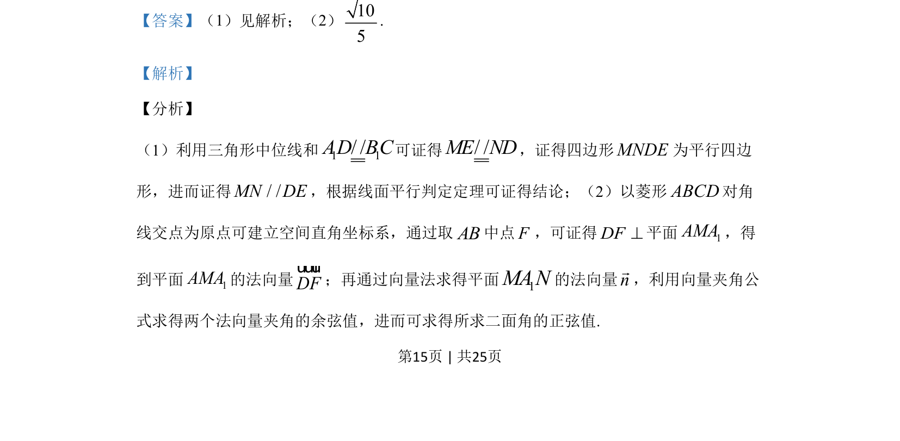
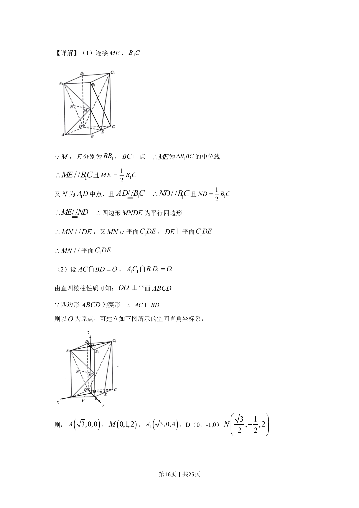
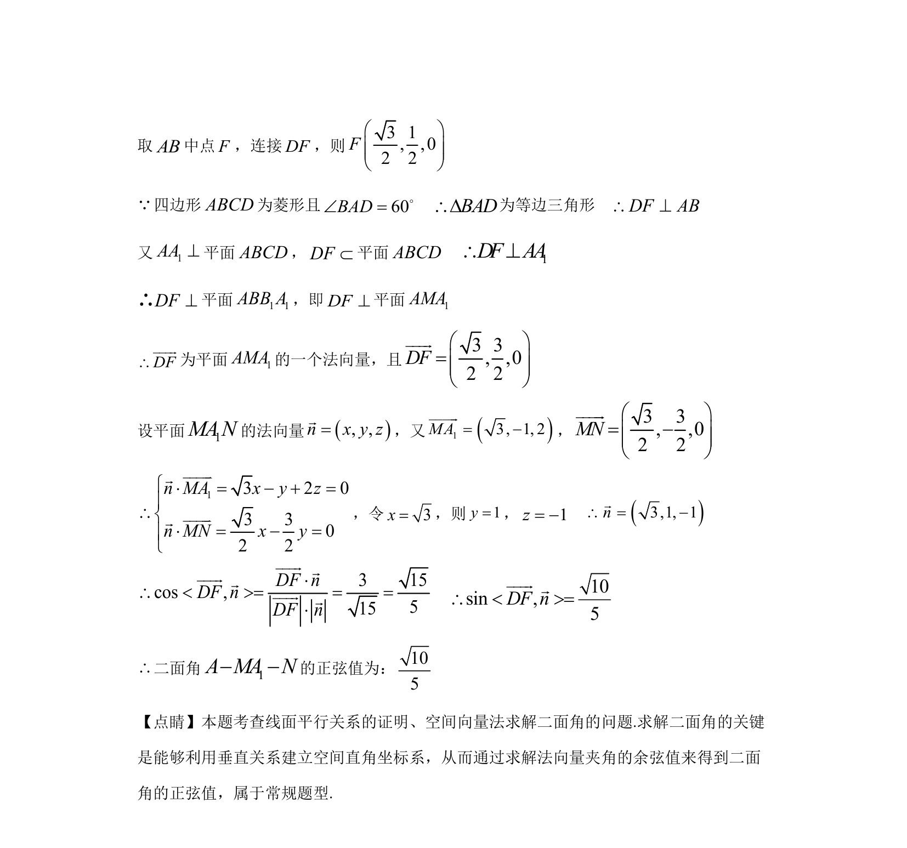

## 题面

## 摘要

该题考查线面平行证明及利用空间向量求二面角正弦值的方法。

## 关联考点

- [[线面平行判定与性质定理]]
- [[空间直角坐标系建立]]
- [[法向量求法]]
- [[向量夹角公式]]

## 答案与解析

> 📄 原 PDF 第 15 页：`素材/真题/湖南/2008-2024·（湖南）数学高考真题/2019年高考数学试卷（理）（新课标Ⅰ）（解析卷）.pdf`
