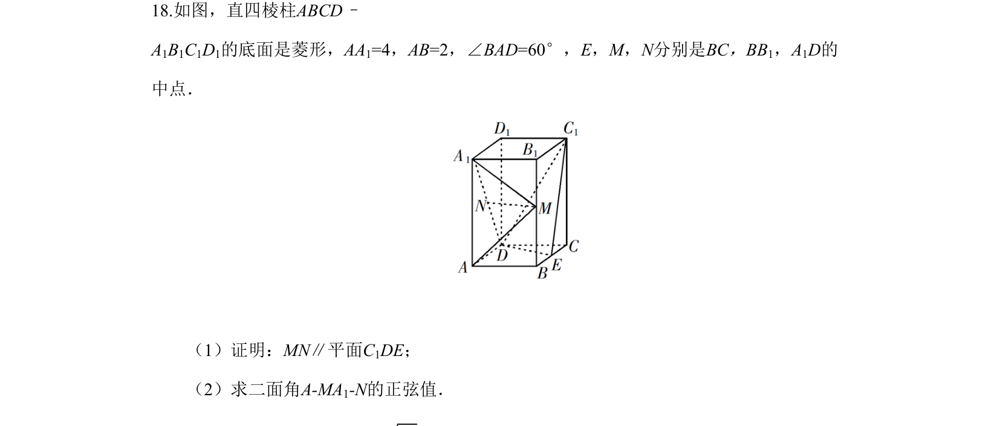
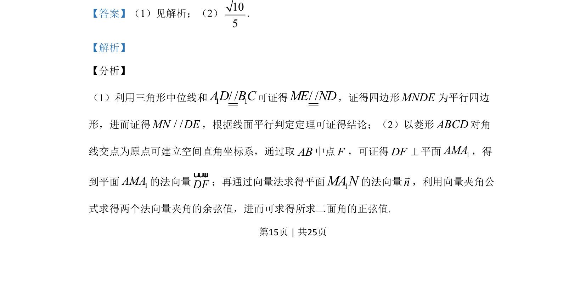
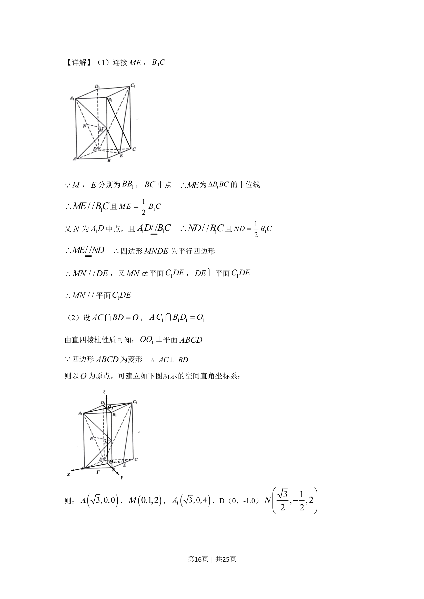
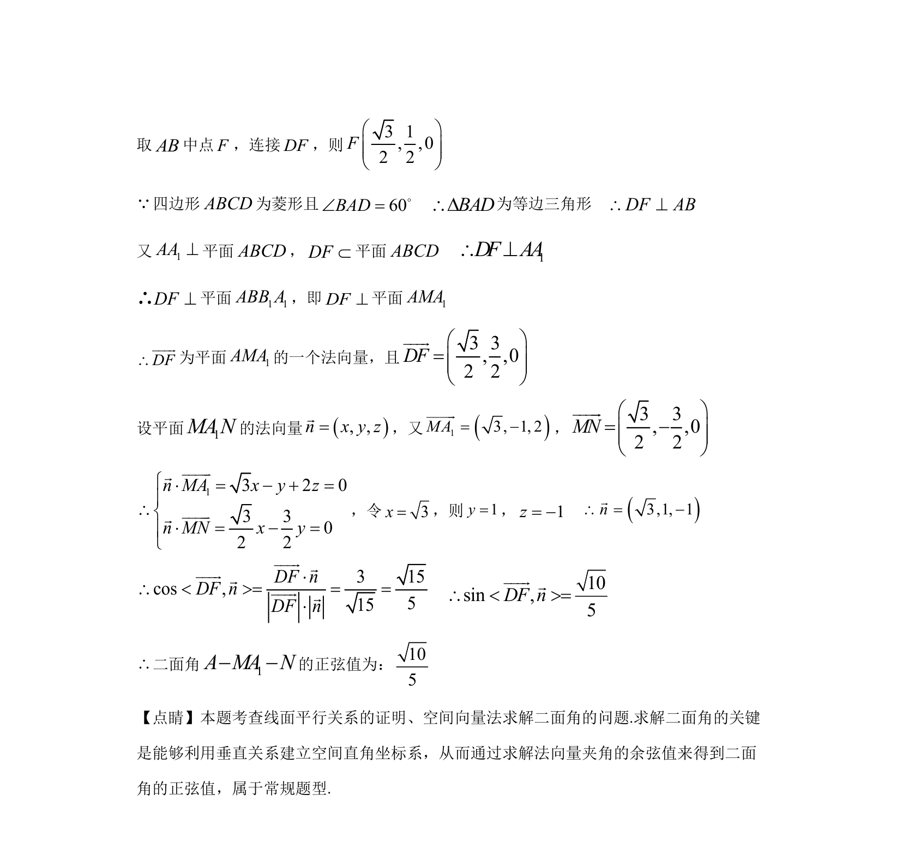

## 题面

## 摘要

该题考查线面平行证明及利用空间向量求二面角正弦值的方法。

## 关联考点

- [[线面平行判定与性质定理]]
- [[空间直角坐标系建立]]
- [[法向量求法]]
- [[向量夹角公式]]

## 答案与解析

> 📄 原 PDF 第 15 页：`素材/真题/湖南/2008-2024·（湖南）数学高考真题/2019年高考数学试卷（理）（新课标Ⅰ）（解析卷）.pdf`

<!-- 题干文本-start -->
## 题干文本
18.如图，直四棱柱ABCD–
A1B1C1D1的底面是菱形，AA1=4，AB=2，∠BAD=60°，E，M，N分别是BC，BB1，A1D的
中点．
（1）证明：MN∥平面C1DE；
（2）求二面角A-MA1-N的正弦值．
<!-- 题干文本-end -->

<!-- 解析文本-start -->
## 解析文本
【答案】（1）见解析；（2）105
.
【解析】
【分析】
（1）利用三角形中位线和1 1/ /AD BC可证得/ /ME ND，证得四边形MNDE为平行四边
形，进而证得/ /MN DE，根据线面平行判定定理可证得结论；（2）以菱形ABCD对角
线交点为原点可建立空间直角坐标系，通过取AB中点F，可证得DF^平面1AMA，得
到平面1AMA的法向量DFuuur
；再通过向量法求得平面1MA N的法向量nr，利用向量夹角公
式求得两个法向量夹角的余弦值，进而可求得所求二面角的正弦值.
<!-- 解析文本-end -->
