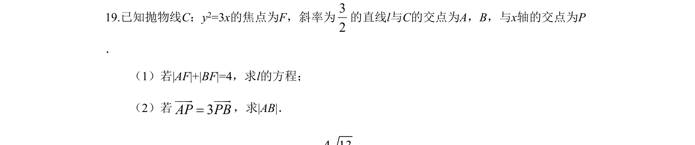
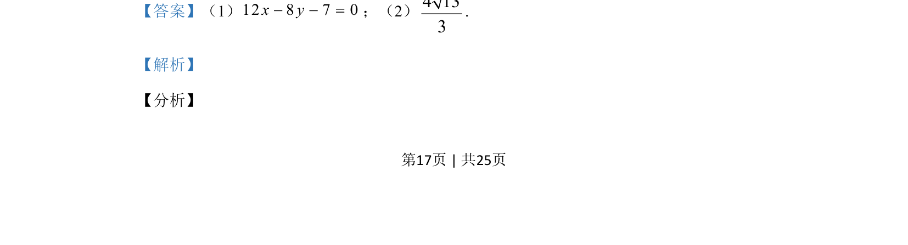
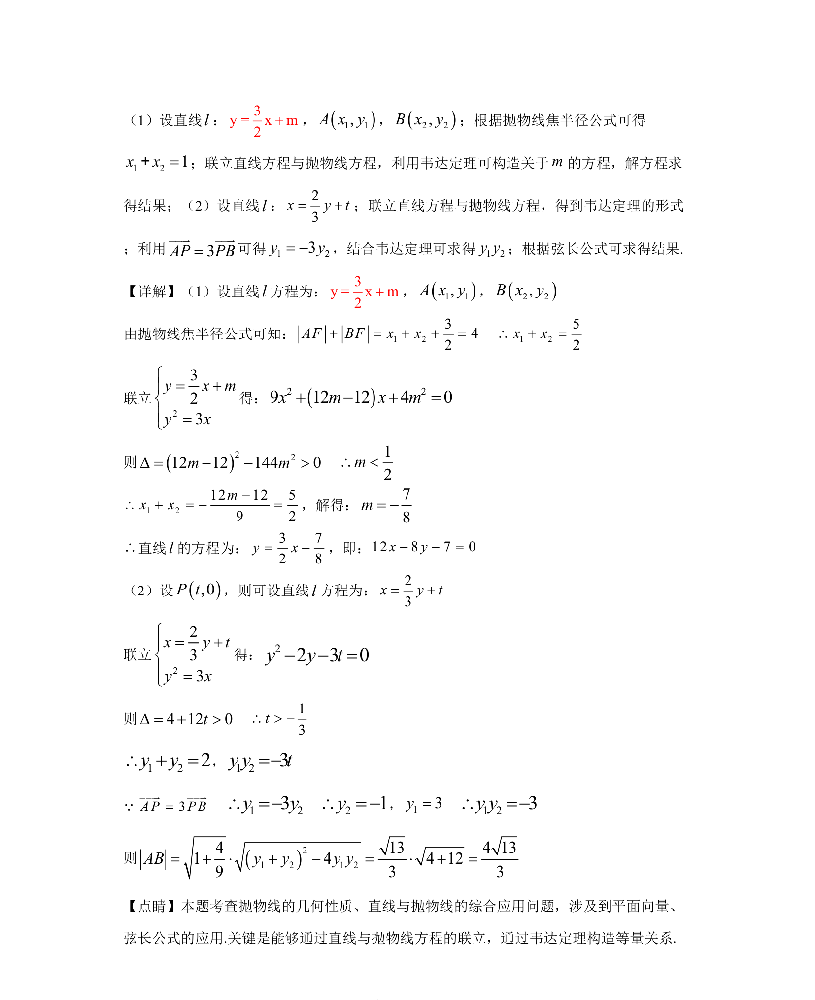

## 题面

## 摘要

考查直线与抛物线的位置关系，涉及焦半径、向量关系及弦长计算。

## 关联考点

- [[227-抛物线|抛物线]]
- [[574-直线与圆锥曲线|直线与圆锥曲线]]
- [[焦半径公式]]
- [[234-韦达定理-初中|韦达定理]]

## 答案与解析

> 📄 原 PDF 第 17 页：`素材/真题/湖南/2008-2024·（湖南）数学高考真题/2019年高考数学试卷（理）（新课标Ⅰ）（解析卷）.pdf`
