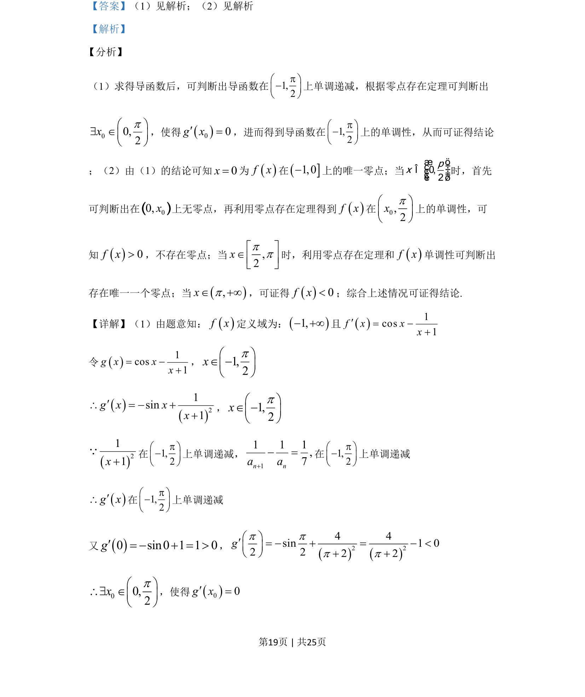
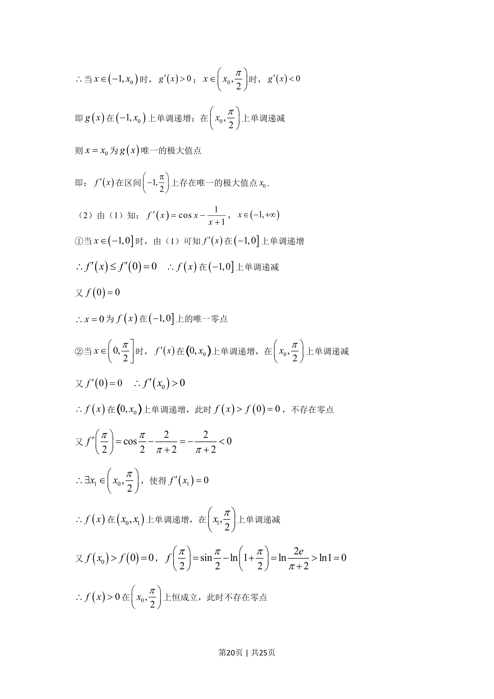
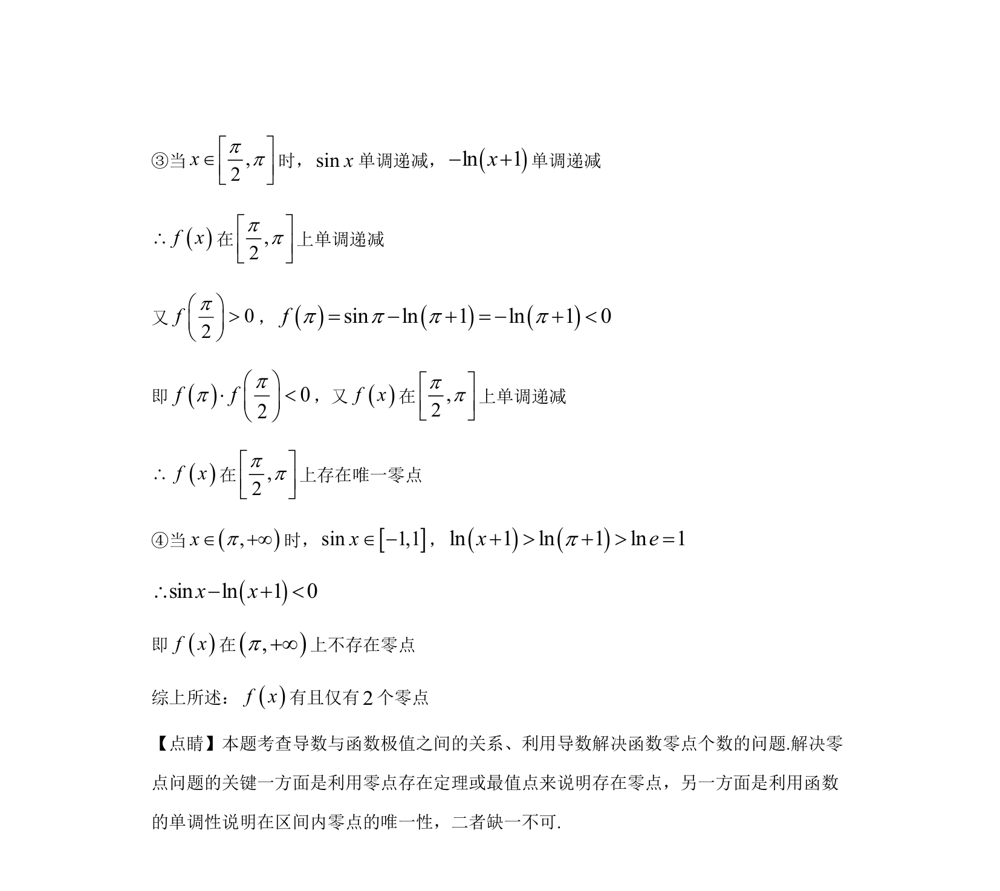

## 题面

## 摘要

该题考查利用导数研究函数单调性、极值点与零点个数，结合零点存在定理进行论证。

## 关联考点

- [[705-利用导数研究函数的单调性|利用导数研究函数的单调性]]
- [[691-函数的极值|函数的极值]]
- [[1143-零点存在定理|零点存在定理]]
- [[函数零点个数]]

## 答案与解析

> 📄 原 PDF 第 18 页：`素材/真题/湖南/2008-2024·（湖南）数学高考真题/2019年高考数学试卷（理）（新课标Ⅰ）（解析卷）.pdf`
