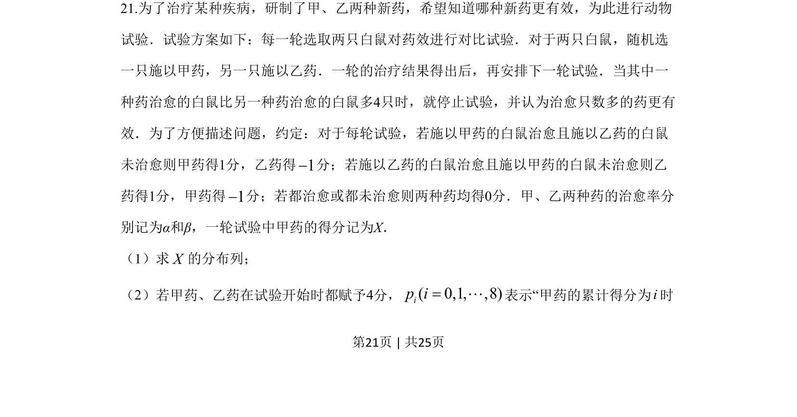
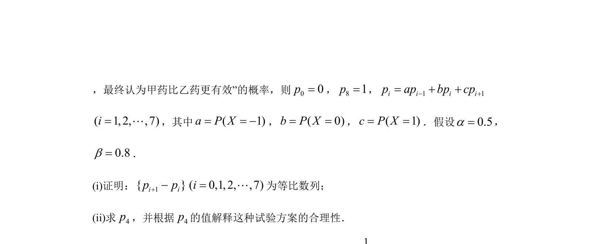
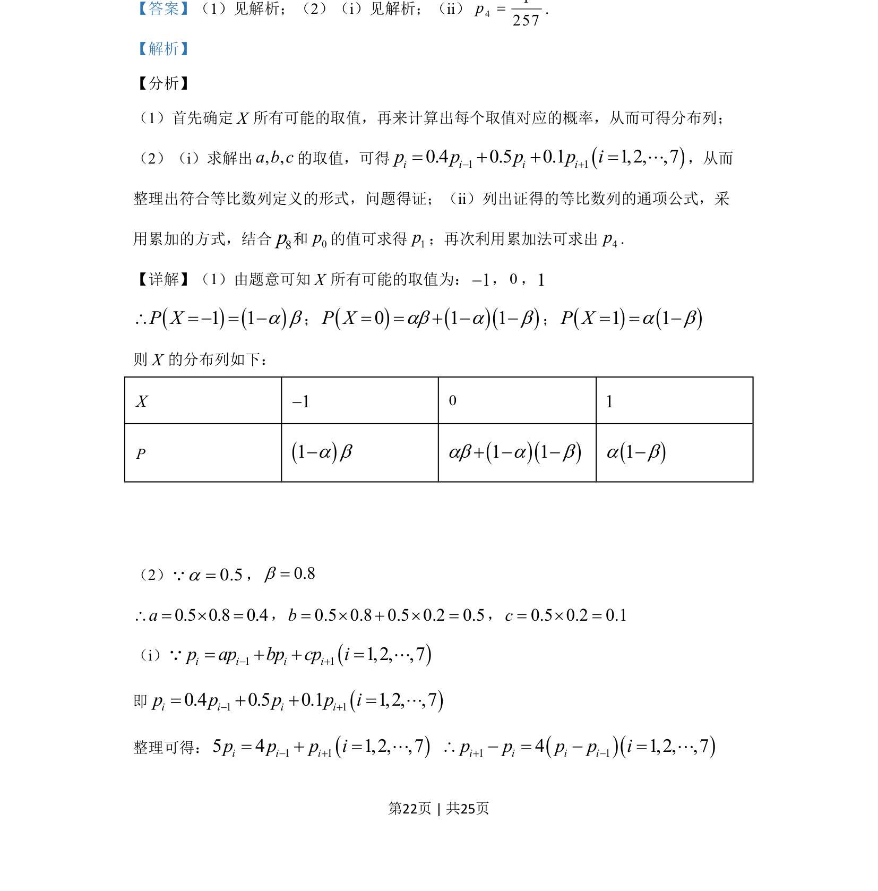
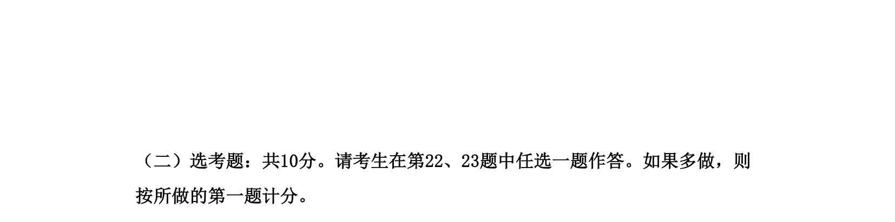

## 题面

## 摘要

该题考查离散型随机变量的分布列及利用递推关系证明等比数列并求通项。

## 关联考点

- [[1330-离散型随机变量及其分布列|离散型随机变量及其分布列]]
- [[等比数列的证明]]
- [[累加法求通项]]

## 答案与解析

> 📄 原 PDF 第 21 页：`素材/真题/湖南/2008-2024·（湖南）数学高考真题/2019年高考数学试卷（理）（新课标Ⅰ）（解析卷）.pdf`
