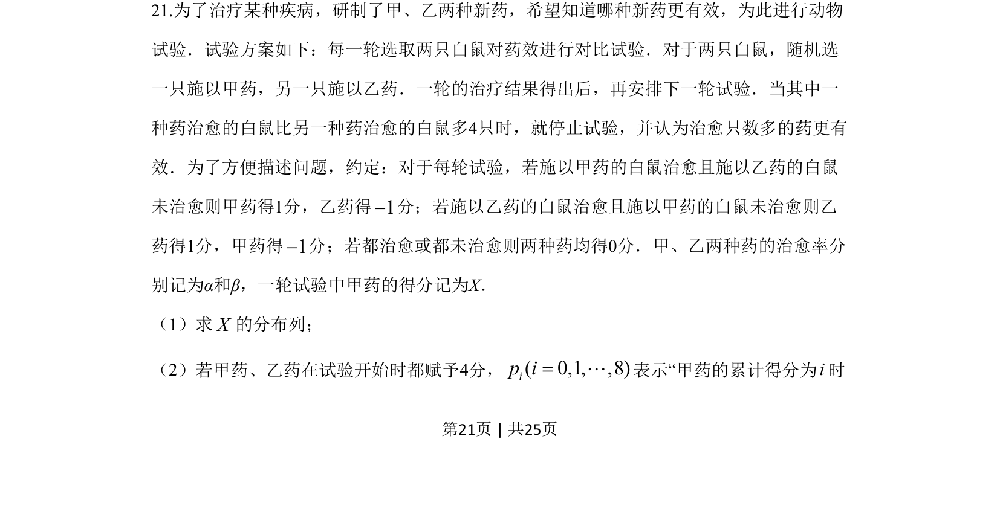
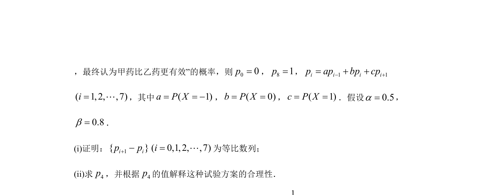
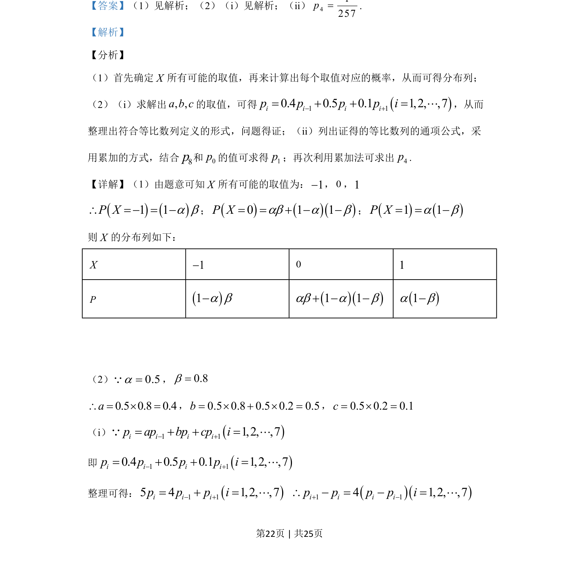
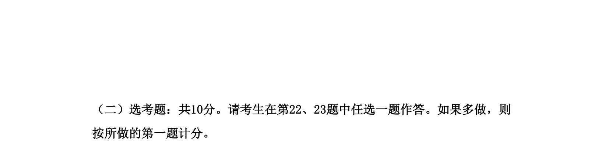

## 题面

## 摘要

该题考查离散型随机变量的分布列及利用递推关系证明等比数列并求通项。

## 关联考点

- [[1330-离散型随机变量及其分布列|离散型随机变量及其分布列]]
- [[等比数列的证明]]
- [[累加法求通项]]

## 答案与解析

> 📄 原 PDF 第 21 页：`素材/真题/湖南/2008-2024·（湖南）数学高考真题/2019年高考数学试卷（理）（新课标Ⅰ）（解析卷）.pdf`

<!-- 题干文本-start -->
## 题干文本
21.为了治疗某种疾病，研制了甲、乙两种新药，希望知道哪种新药更有效，为此进行动物
试验．试验方案如下：每一轮选取两只白鼠对药效进行对比试验．对于两只白鼠，随机选
一只施以甲药，另一只施以乙药．一轮的治疗结果得出后，再安排下一轮试验．当其中一
种药治愈的白鼠比另一种药治愈的白鼠多4只时，就停止试验，并认为治愈只数多的药更有
效．为了方便描述问题，约定：对于每轮试验，若施以甲药的白鼠治愈且施以乙药的白鼠
未治愈则甲药得1分，乙药得1-分；若施以乙药的白鼠治愈且施以甲药的白鼠未治愈则乙
药得1分，甲药得1-分；若都治愈或都未治愈则两种药均得0分．甲、乙两种药的治愈率分
别记为α和β，一轮试验中甲药的得分记为X．
（1）求X的分布列；
（2）若甲药、乙药在试验开始时都赋予4分，( 0,1, ,8)ip i=L表示“甲药的累计得分为i时
<!-- 题干文本-end -->

<!-- 解析文本-start -->
## 解析文本

<!-- 解析文本-end -->
