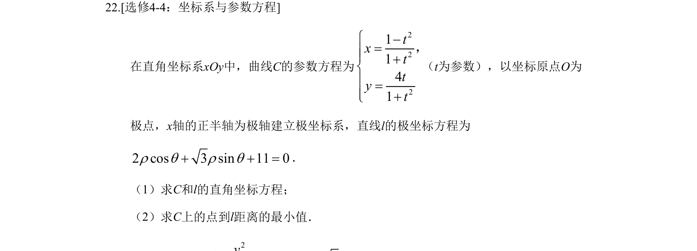
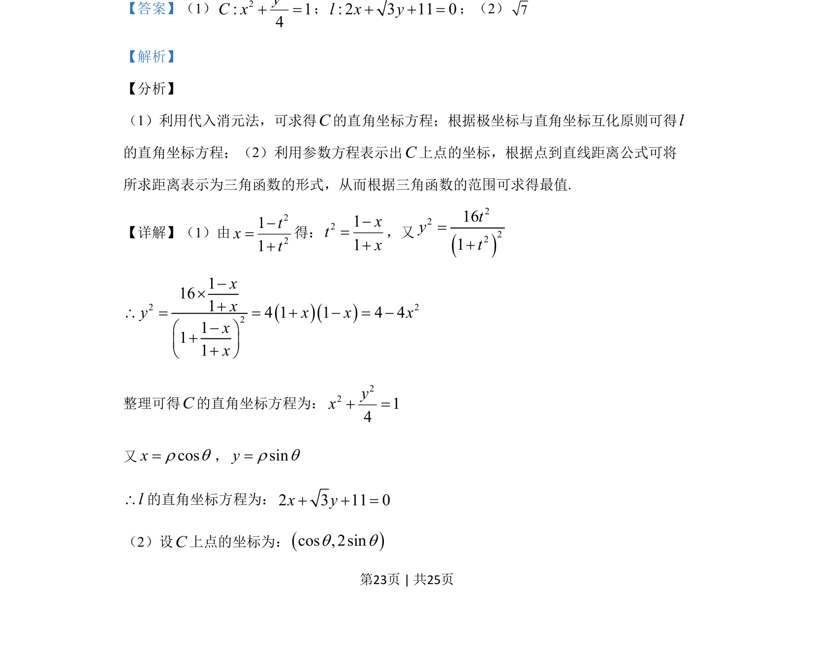
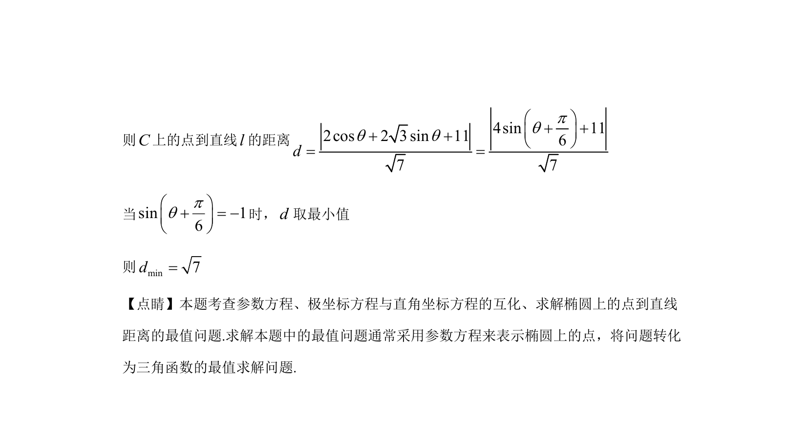

## 题面

## 摘要

考查参数方程、极坐标方程与直角坐标方程的互化，以及椭圆上点到直线距离的最值问题。

## 关联考点

- [[920-极坐标与直角坐标互化|极坐标与直角坐标互化]]
- [[1273-参数方程与普通方程互化|参数方程与普通方程互化]]
- [[570-点到直线的距离公式|点到直线距离公式]]
- [[615-三角函数的最值|三角函数最值]]

## 答案与解析

> 📄 原 PDF 第 23 页：`素材/真题/湖南/2008-2024·（湖南）数学高考真题/2019年高考数学试卷（理）（新课标Ⅰ）（解析卷）.pdf`

<!-- 题干文本-start -->
## 题干文本
22.[选修4-4：坐标系与参数方程] 
在直角坐标系xOy中，曲线C的参数方程为
2221141txttytì-=ïï+íï=ï+î，
（t为参数），以坐标原点O为
极点，x轴的正半轴为极轴建立极坐标系，直线l的极坐标方程为
2 cos 3 sin 11 0r q r q+ + =．
（1）求C和l的直角坐标方程；
（2）求C上的点到l距离的最小值．
<!-- 题干文本-end -->

<!-- 解析文本-start -->
## 解析文本
【答案】（1）
22: 14yC x+ =；: 2 3 11 0l x y+ + =；（2）7
【解析】
【分析】
（1）利用代入消元法，可求得C的直角坐标方程；根据极坐标与直角坐标互化原则可得l
的直角坐标方程；（2）利用参数方程表示出C上点的坐标，根据点到直线距离公式可将
所求距离表示为三角函数的形式，从而根据三角函数的范围可求得最值.
【详解】（1）由
2211txt-=+
得：211xtx-=+
，又
2222161tyt=+2 2211614 1 1 4 4111xxy x x xxx-´+\ = = + - = --æ ö+ç ÷+è ø
整理可得C的直角坐标方程为：
2214yx+ =
又cosxr q=，sinyr q=l\的直角坐标方程为：2 3 11 0x y+ + =
（2）设C上点的坐标为：cos , 2sinq q
<!-- 解析文本-end -->
