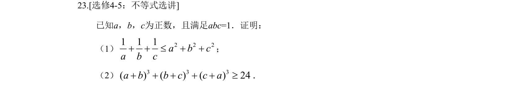
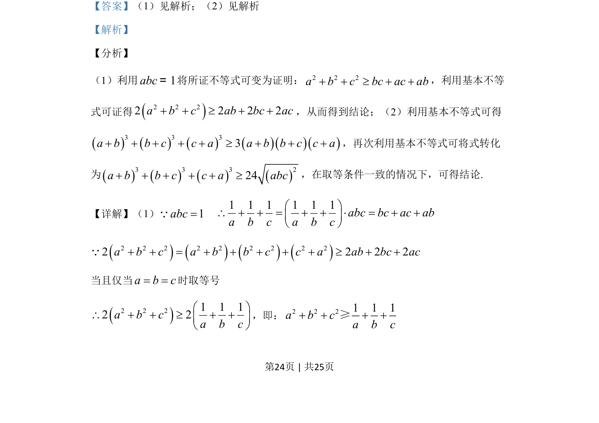
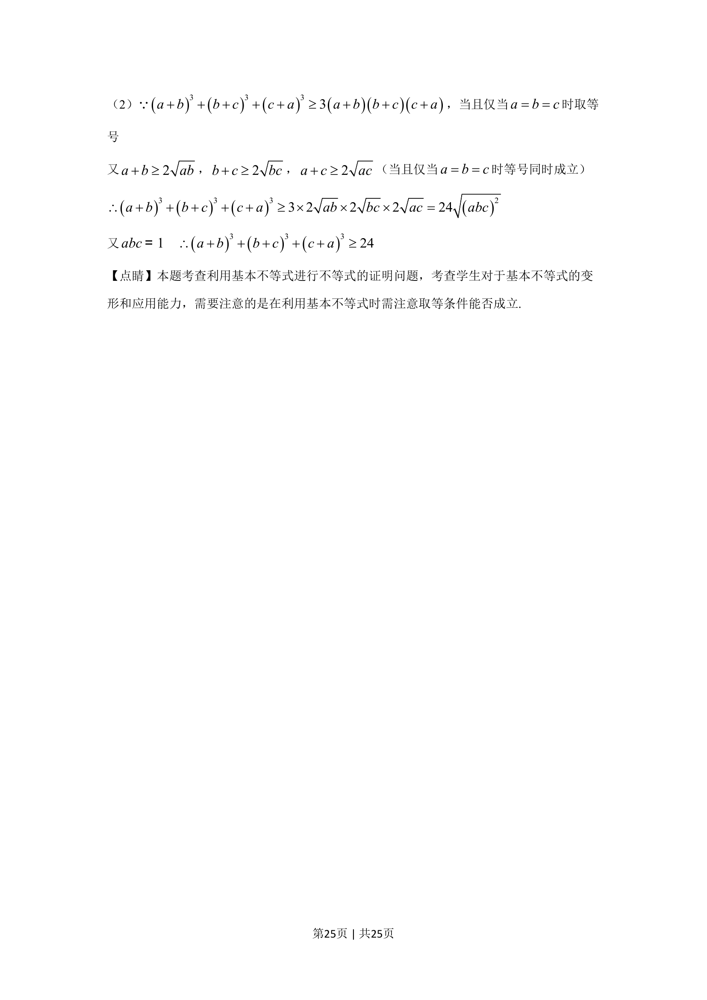

## 题面

## 摘要

证明不等式，运用基本不等式和取等条件分析。

## 关联考点

- [[295-基本不等式|基本不等式]]
- [[624-不等式的证明|不等式证明]]
- [[代数变形]]

## 答案与解析

> 📄 原 PDF 第 24 页：`素材/真题/湖南/2008-2024·（湖南）数学高考真题/2019年高考数学试卷（理）（新课标Ⅰ）（解析卷）.pdf`

<!-- 题干文本-start -->
## 题干文本
23.[选修4-5：不等式选讲]
已知a，b，c为正数，且满足abc=1．证明：
（1） 2 2 21 1 1a b ca b c+ + £ + +；
（2） 3 3 3( ) ( ) ( ) 24a b b c c a+ + +³+ +．
<!-- 题干文本-end -->

<!-- 解析文本-start -->
## 解析文本
【答案】（1）见解析；（2）见解析
【解析】
【分析】
（1）利用1abc=将所证不等式可变为证明：2 2 2a b c bc ac ab+ + ³ + +，利用基本不等
式可证得()2 2 22 2 2 2a b c ab bc ac+ + ³ + +，从而得到结论；（2）利用基本不等式可得
()()()()()()3 3 33a b b c c a a b b c c a+ + + + + ³ + + +，再次利用基本不等式可将式转化
为()()()()3 3 3 224a b b c c a abc+ + + + + ³，在取等条件一致的情况下，可得结论.
【详解】（1）1abc=Q    1 1 1 1 1 1abc bc ac aba b c a b cæ ö\ + + = + + × = + +ç ÷è ø()()()()2 2 2 2 2 2 2 2 22 2 2 2a b c a b b c c a ab bc ac+ + = + + + + + ³ + +Q
当且仅当a b c= =时取等号
()2 2 21 1 12 2a b ca b cæ ö\ + + ³ + +ç ÷è ø
，即：2 2 21 1 1a b ca b c+ + + +≥
<!-- 解析文本-end -->
