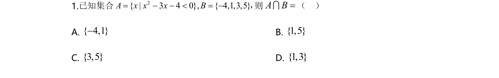
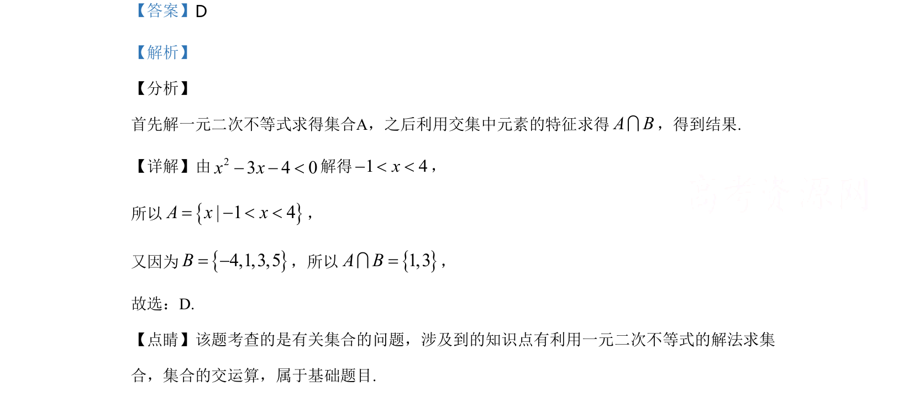

## 题面

## 摘要

该题考查一元二次不等式的解法及集合的交集运算。

## 关联考点

- [[267-一元二次不等式|一元二次不等式]]
- [[1139-集合的交集|集合的交集]]

## 答案与解析

> 📄 原 PDF 第 1 页：`素材/真题/湖南/2008-2024·（湖南）数学高考真题/2020年高考数学试卷（文）（新课标Ⅰ）（解析卷）.pdf`

<!-- 题干文本-start -->
## 题干文本
1.已知集合 2{ | 3 4 0}, { 4,1,3,5}A x x x B= - - < = -，则A B=I（    ）
A. { 4,1 }- B. { 1,5}
C. {3,5}D. { 1,3 }
<!-- 题干文本-end -->

<!-- 解析文本-start -->
## 解析文本
【答案】D
【解析】
【分析】
首先解一元二次不等式求得集合A，之后利用交集中元素的特征求得A BI，得到结果.
【详解】由23 4 0x x- - <解得1 4x- < <，
所以{}| 1 4A x x= - < <，
又因为{}4,1,3,5B= -，所以{}1,3A B=I，
故选：D.
【点睛】该题考查的是有关集合的问题，涉及到的知识点有利用一元二次不等式的解法求集
合，集合的交运算，属于基础题目.
<!-- 解析文本-end -->
