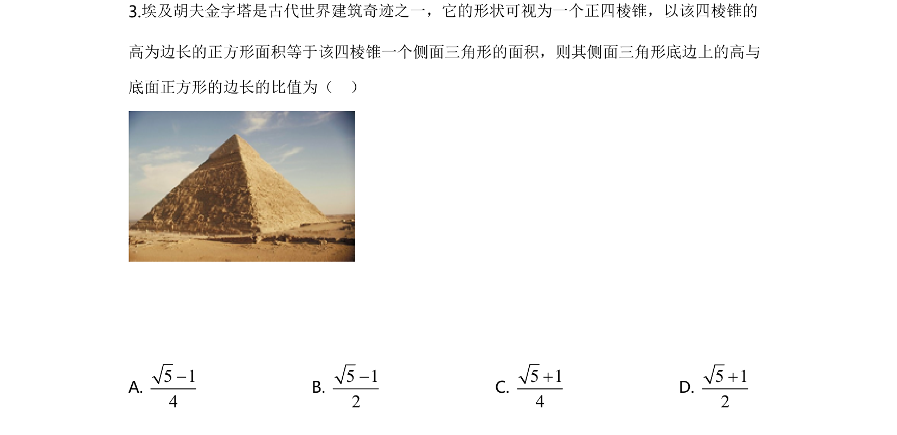
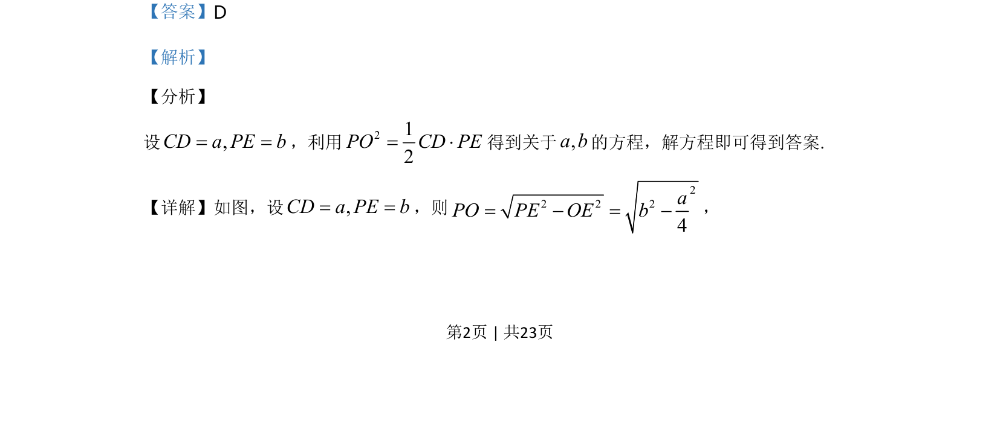
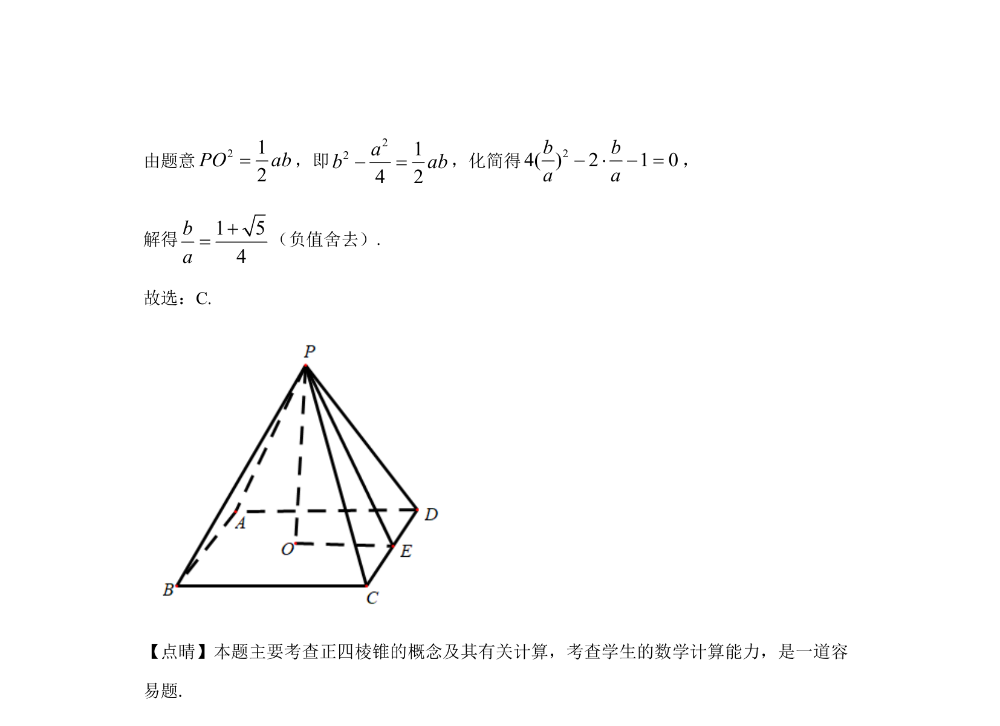

## 题面

## 摘要

本题通过正四棱锥的几何关系建立方程并求解相关线段比值。

## 关联考点

- [[957-正四棱锥|正四棱锥]]
- [[671-几何计算|几何计算]]
- [[061-方程|方程求解]]

## 答案与解析

> 📄 原 PDF 第 2 页：`素材/真题/湖南/2008-2024·（湖南）数学高考真题/2020年高考数学试卷（文）（新课标Ⅰ）（解析卷）.pdf`
