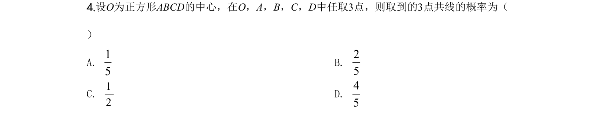
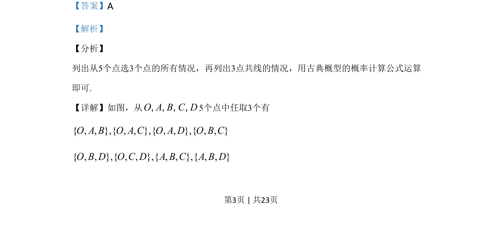
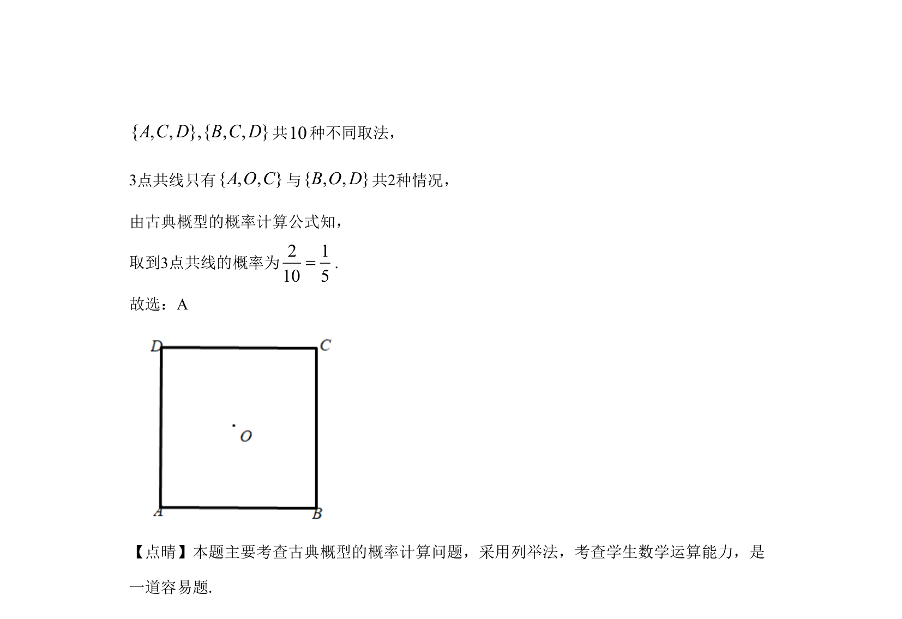

## 题面

## 摘要

从5个点中选取3个点的组合，利用列举法求三点共线的古典概型概率。

## 关联考点

- [[320-古典概型|古典概型]]
- [[703-列举法|列举法]]
- [[1090-组合计数|组合计数]]
- [[948-概率计算|概率计算]]

## 答案与解析

> 📄 原 PDF 第 3 页：`素材/真题/湖南/2008-2024·（湖南）数学高考真题/2020年高考数学试卷（文）（新课标Ⅰ）（解析卷）.pdf`
