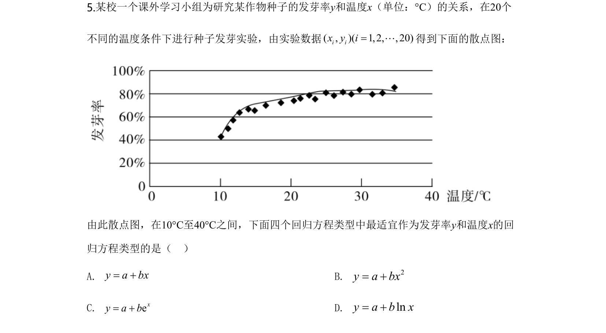
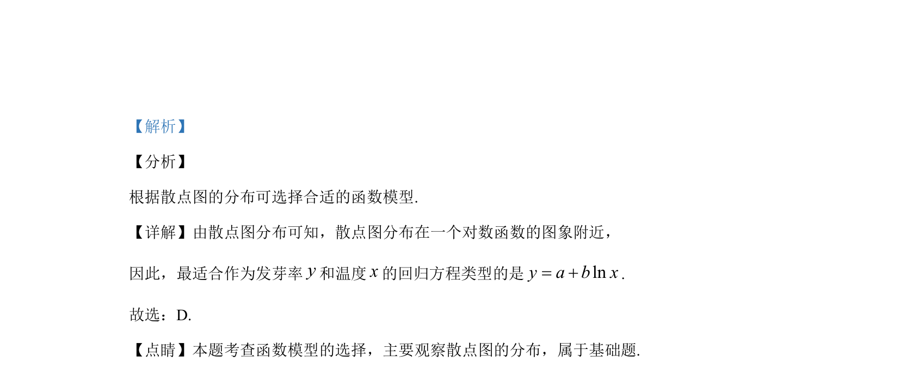

## 题面

## 摘要

根据散点图分布选择对数型回归方程模型

## 关联考点

- [[488-散点图|散点图]]
- [[回归方程选择]]
- [[对数函数模型]]

## 答案与解析

> 📄 原 PDF 第 4 页：`素材/真题/湖南/2008-2024·（湖南）数学高考真题/2020年高考数学试卷（文）（新课标Ⅰ）（解析卷）.pdf`

<!-- 题干文本-start -->
## 题干文本
5.某校一个课外学习小组为研究某作物种子的发芽率y和温度x（单位：°C）的关系，在20个
不同的温度条件下进行种子发芽实验，由实验数据( , )( 1,2, ,20)i ix y i=L得到下面的散点图：
由此散点图，在10°C至40°C之间，下面四个回归方程类型中最适宜作为发芽率y和温度x的回
归方程类型的是（    ）
A. y a bx= +B. 2y a bx= +
C. exy a b= +D. lny a b x= +
<!-- 题干文本-end -->

<!-- 解析文本-start -->
## 解析文本
【答案】D
<!-- 解析文本-end -->
