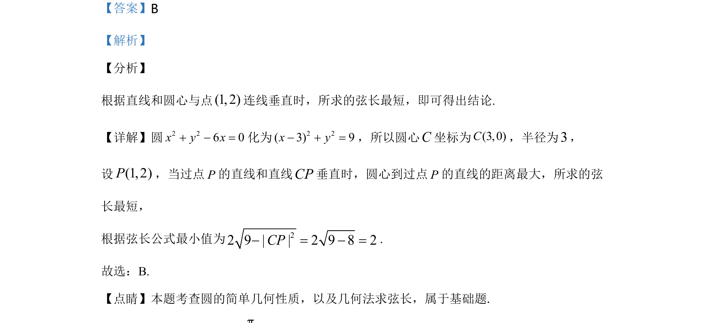

## 题面

## 摘要

圆的标准方程与几何性质，利用垂直关系求弦长最小值

## 关联考点

- [[782-圆的方程|圆的方程]]
- [[394-直线和圆位置关系-高中|直线与圆的位置关系]]
- [[867-弦长公式|弦长公式]]
- [[980-点到直线的距离|点到直线的距离]]

## 答案与解析

> 📄 原 PDF 第 5 页：`素材/真题/湖南/2008-2024·（湖南）数学高考真题/2020年高考数学试卷（文）（新课标Ⅰ）（解析卷）.pdf`
