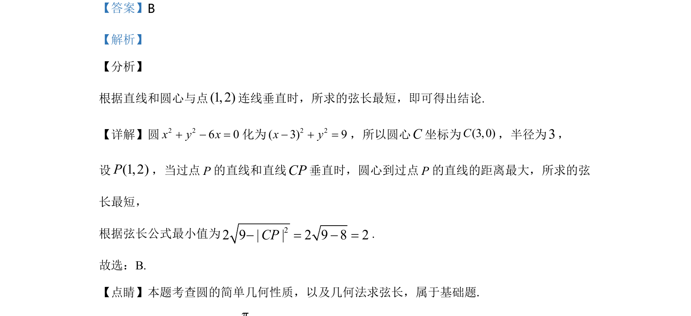

## 题面

## 摘要

圆的标准方程与几何性质，利用垂直关系求弦长最小值

## 关联考点

- [[782-圆的方程|圆的方程]]
- [[394-直线和圆位置关系-高中|直线与圆的位置关系]]
- [[867-弦长公式|弦长公式]]
- [[1211-点到直线距离|点到直线的距离]]

## 答案与解析

> 📄 原 PDF 第 5 页：`素材/真题/湖南/2008-2024·（湖南）数学高考真题/2020年高考数学试卷（文）（新课标Ⅰ）（解析卷）.pdf`

<!-- 题干文本-start -->
## 题干文本
6.已知圆2260xyx+-=，过点（1，2）的直线被该圆所截得的弦的长度的最小值为（    ）
A. 1 B. 2
C. 3 D. 4
<!-- 题干文本-end -->

<!-- 解析文本-start -->
## 解析文本
【答案】B
【解析】
【分析】
根据直线和圆心与点(1, 2)连线垂直时，所求的弦长最短，即可得出结论.
【详解】圆2260xyx+-=化为 22(3)9xy-+=，所以圆心C坐标为(3,0)C，半径为3，
设(1,2)P，当过点P的直线和直线CP垂直时，圆心到过点P的直线的距离最大，所求的弦
长最短，
根据弦长公式最小值为 22 9 | | 2 9 8 2CP- = - =.
故选：B.
【点睛】本题考查圆的简单几何性质，以及几何法求弦长，属于基础题.
<!-- 解析文本-end -->
