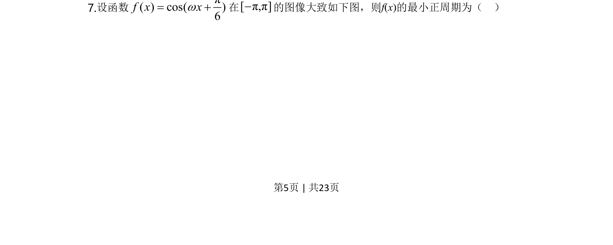
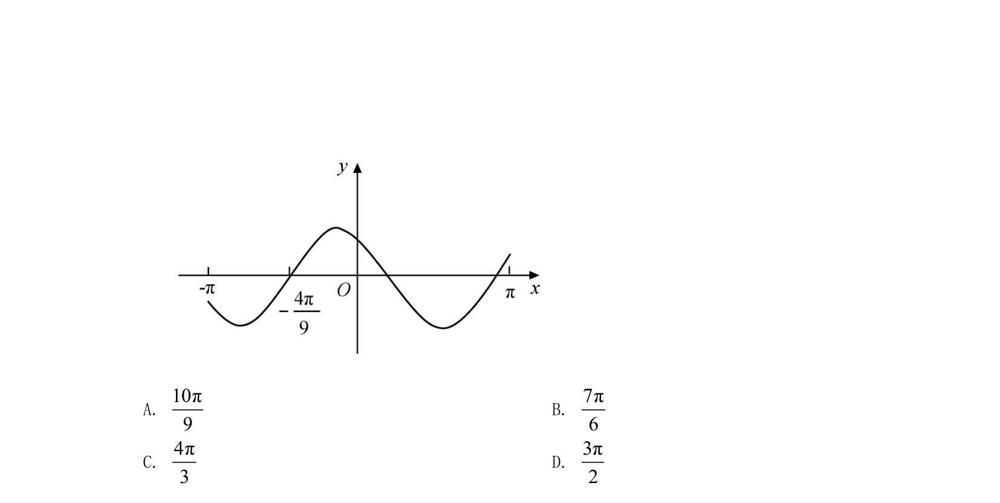
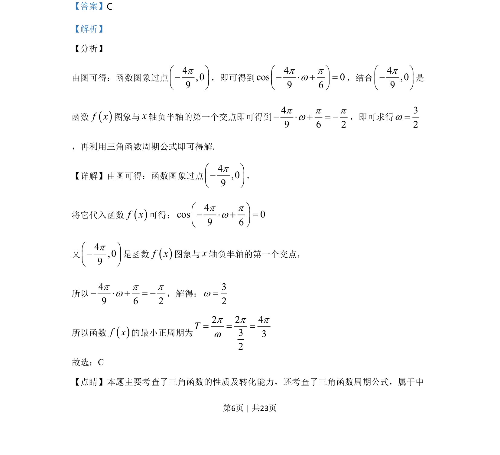

## 题面

## 摘要

该题根据余弦型函数图象过给定点求参数ω，进而求得函数周期。

## 关联考点

- [[余弦函数的图象与性质]]
- [[根据图象求解析式]]
- [[759-周期公式|三角函数的周期公式]]

## 答案与解析

> 📄 原 PDF 第 5 页：`素材/真题/湖南/2008-2024·（湖南）数学高考真题/2020年高考数学试卷（文）（新课标Ⅰ）（解析卷）.pdf`
