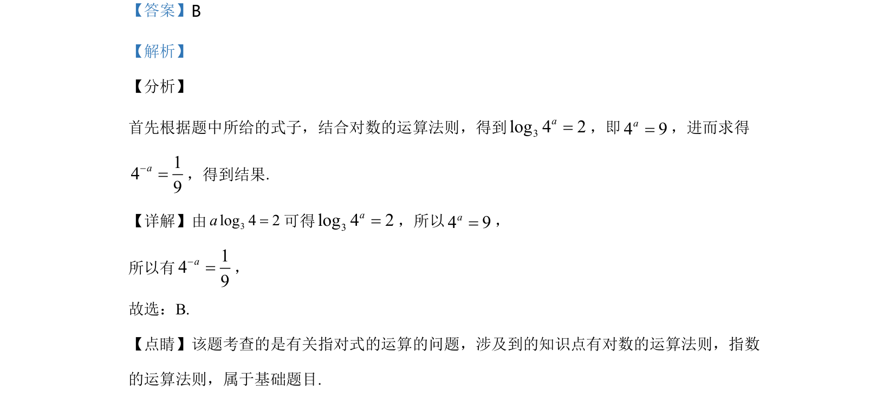

## 题面

## 摘要

考查对数的运算法则与指数运算，通过已知对数等式求值。

## 关联考点

- [[对数的运算法则]]
- [[指数的运算法则]]

## 答案与解析

> 📄 原 PDF 第 7 页：`素材/真题/湖南/2008-2024·（湖南）数学高考真题/2020年高考数学试卷（文）（新课标Ⅰ）（解析卷）.pdf`

<!-- 题干文本-start -->
## 题干文本
8.设3log 4 2a=，则4a-=（    ）
A. 116
B. 19
C. 18
D. 16
<!-- 题干文本-end -->

<!-- 解析文本-start -->
## 解析文本
【答案】B
【解析】
【分析】
首先根据题中所给的式子，结合对数的运算法则，得到3log 4 2a=，即4 9a=，进而求得
149a-=，得到结果.
【详解】由3log 4 2a=可得3log 4 2a=，所以4 9a=，
所以有149a-=，
故选：B.
【点睛】该题考查的是有关指对式的运算的问题，涉及到的知识点有对数的运算法则，指数
的运算法则，属于基础题目.
<!-- 解析文本-end -->
