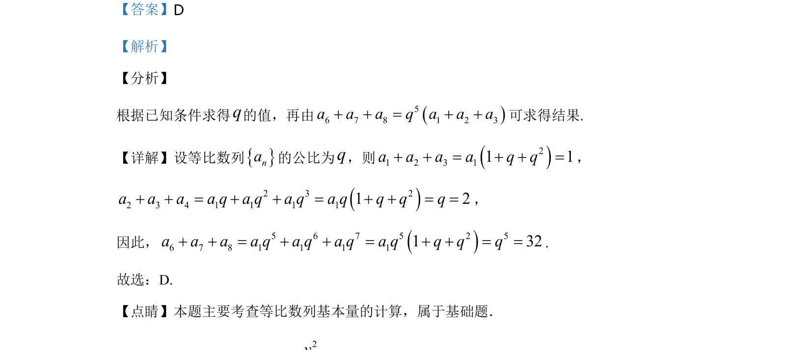

## 题面

## 摘要

本题考查等比数列通项公式及前n项和的基本量计算，通过已知项和关系求公比再求特定项之和。

## 关联考点

- [[1067-等比数列的定义与通项公式|等比数列]]
- [[358-等比数列概念|公比]]
- [[384-数列通项公式|通项公式]]

## 答案与解析

> 📄 原 PDF 第 8 页：`素材/真题/湖南/2008-2024·（湖南）数学高考真题/2020年高考数学试卷（文）（新课标Ⅰ）（解析卷）.pdf`
