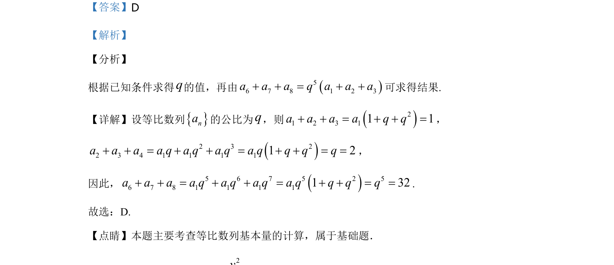

## 题面

## 摘要

本题考查等比数列通项公式及前n项和的基本量计算，通过已知项和关系求公比再求特定项之和。

## 关联考点

- [[1067-等比数列的定义与通项公式|等比数列]]
- [[358-等比数列概念|公比]]
- [[384-数列通项公式|通项公式]]

## 答案与解析

> 📄 原 PDF 第 8 页：`素材/真题/湖南/2008-2024·（湖南）数学高考真题/2020年高考数学试卷（文）（新课标Ⅰ）（解析卷）.pdf`

<!-- 题干文本-start -->
## 题干文本
10.设{ }na是等比数列，且1 2 31a a a+ + =，2 3 4+ 2a a a+ =，则6 7 8a a a+ + =（    ）
A. 12 B. 24 C. 30 D. 32
<!-- 题干文本-end -->

<!-- 解析文本-start -->
## 解析文本
【答案】D
【解析】
【分析】
根据已知条件求得q的值，再由 56 7 8 1 2 3a a a q a a a+ + = + +可求得结果.
【详解】设等比数列na的公比为q，则 21 2 3 11 1a a a a q q+ + = + + =，
2 3 22 3 4 1 1 1 11 2a a a a q a q a q a q q q q+ + = + + = + + = =，
因此， 5 6 7 5 2 56 7 8 1 1 1 11 32a a a a q a q a q a q q q q+ + = + + = + + = =.
故选：D.
【点睛】本题主要考查等比数列基本量的计算，属于基础题．
<!-- 解析文本-end -->
