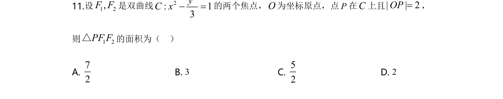
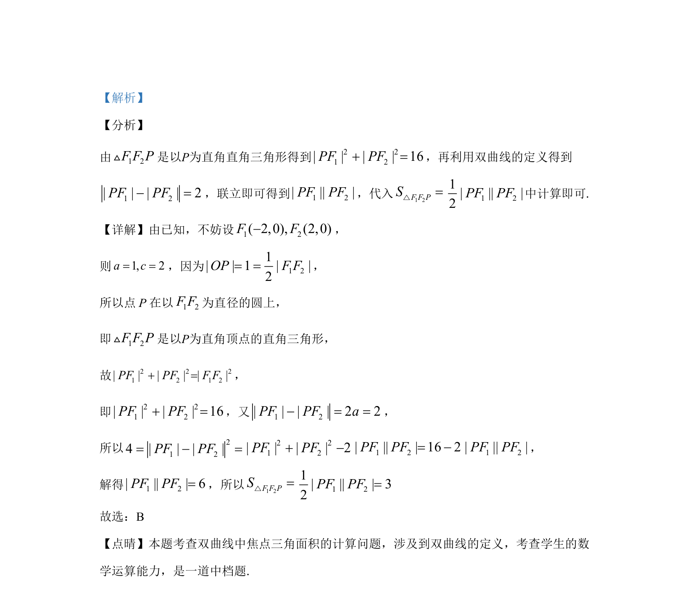

## 题面

## 摘要

双曲线定义与直角三角形性质结合求焦点三角形面积

## 关联考点

- [[730-双曲线的定义|双曲线的定义]]
- [[189-勾股定理|勾股定理]]
- [[062-多边形面积|三角形面积]]

## 答案与解析

> 📄 原 PDF 第 8 页：`素材/真题/湖南/2008-2024·（湖南）数学高考真题/2020年高考数学试卷（文）（新课标Ⅰ）（解析卷）.pdf`
