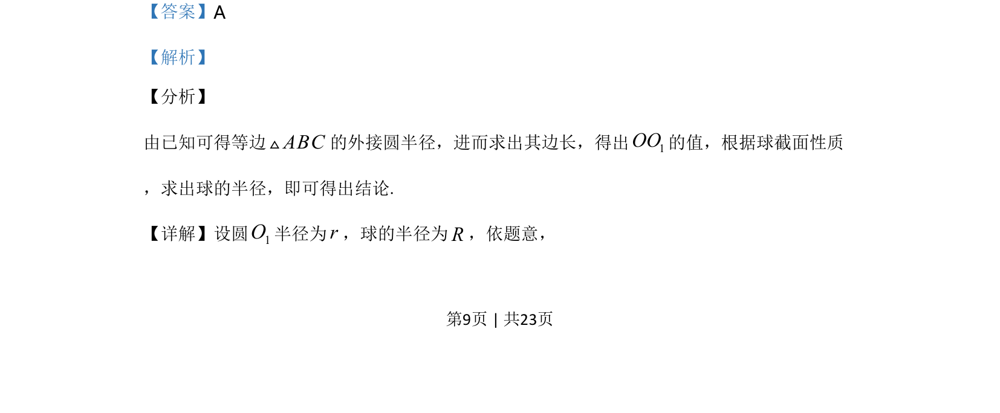
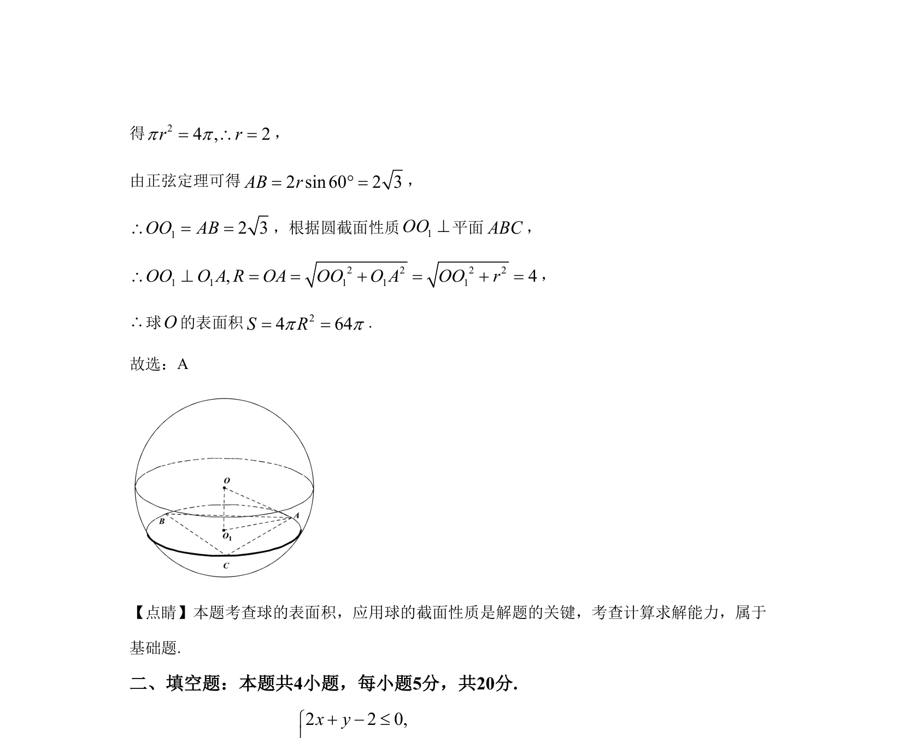

## 题面

## 摘要

该题通过等边三角形外接圆半径及正弦定理求边长，再利用球截面性质计算球的半径，最终求球的表面积。

## 关联考点

- [[126-定理|正弦定理]]
- [[球的截面性质]]
- [[993-球的表面积|球的表面积]]

## 答案与解析

> 📄 原 PDF 第 9 页：`素材/真题/湖南/2008-2024·（湖南）数学高考真题/2020年高考数学试卷（文）（新课标Ⅰ）（解析卷）.pdf`
