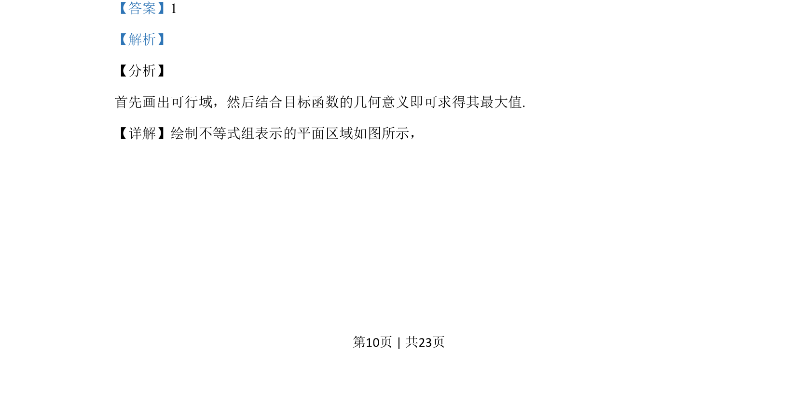
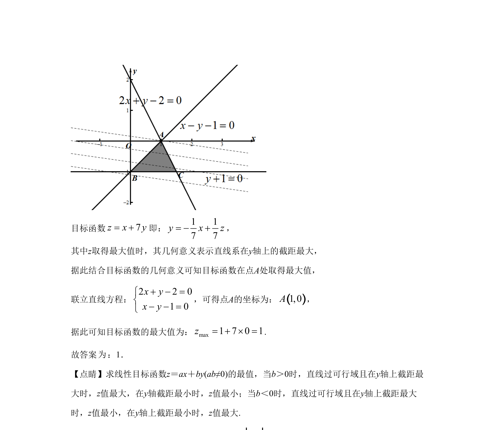

## 题面

## 摘要

考查线性规划中目标函数的最大值求解，通过画出可行域并根据截距意义确定最优解。

## 关联考点

- [[1074-简单线性规划|线性规划]]
- [[1156-可行域|可行域]]
- [[1000-目标函数最值|目标函数最值]]

## 答案与解析

> 📄 原 PDF 第 10 页：`素材/真题/湖南/2008-2024·（湖南）数学高考真题/2020年高考数学试卷（文）（新课标Ⅰ）（解析卷）.pdf`

<!-- 题干文本-start -->
## 题干文本
13.若x，y满足约束条件
2 2 0,1 0,1 0,x yx yy+ - £ìï- - ³íï+ ³î
则z=x+7y的最大值为______________.
<!-- 题干文本-end -->

<!-- 解析文本-start -->
## 解析文本
【答案】1
【解析】
【分析】
首先画出可行域，然后结合目标函数的几何意义即可求得其最大值.
【详解】绘制不等式组表示的平面区域如图所示，
<!-- 解析文本-end -->
