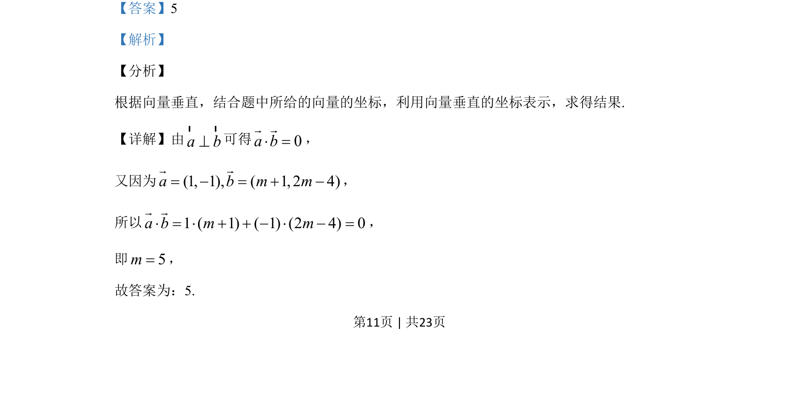
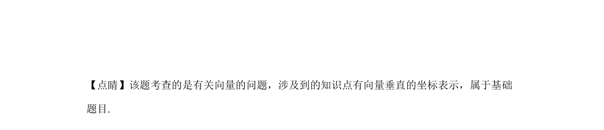

## 题面

## 摘要

该题考查平面向量垂直的坐标表示及利用数量积为零求参数。

## 关联考点

- [[542-向量垂直|向量垂直]]
- [[556-数量积坐标运算|数量积坐标运算]]
- [[061-方程|方程求解]]

## 答案与解析

> 📄 原 PDF 第 11 页：`素材/真题/湖南/2008-2024·（湖南）数学高考真题/2020年高考数学试卷（文）（新课标Ⅰ）（解析卷）.pdf`
