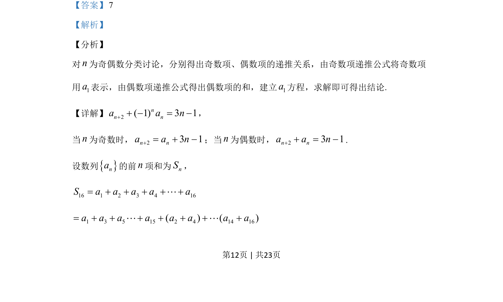
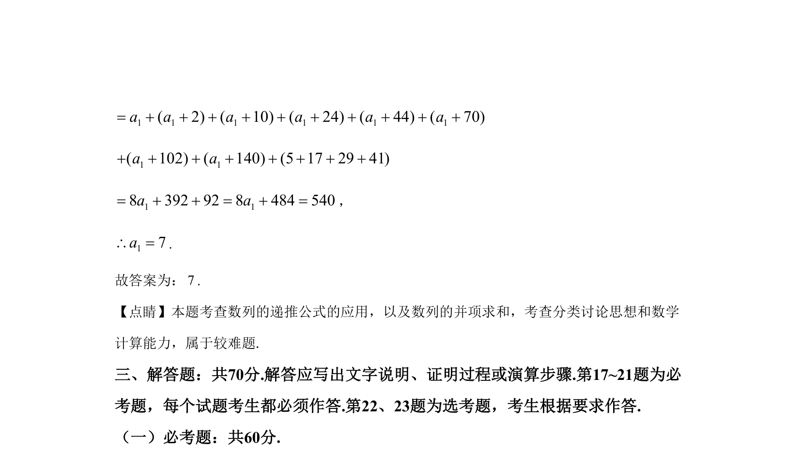

## 题面

## 摘要

考查数列递推关系，需分奇偶讨论并求和建立方程求解。

## 关联考点

- [[1382-数列递推|数列递推]]
- [[奇偶分类讨论]]
- [[355-等差数列前n项和|前n项和]]

## 答案与解析

> 📄 原 PDF 第 12 页：`素材/真题/湖南/2008-2024·（湖南）数学高考真题/2020年高考数学试卷（文）（新课标Ⅰ）（解析卷）.pdf`
