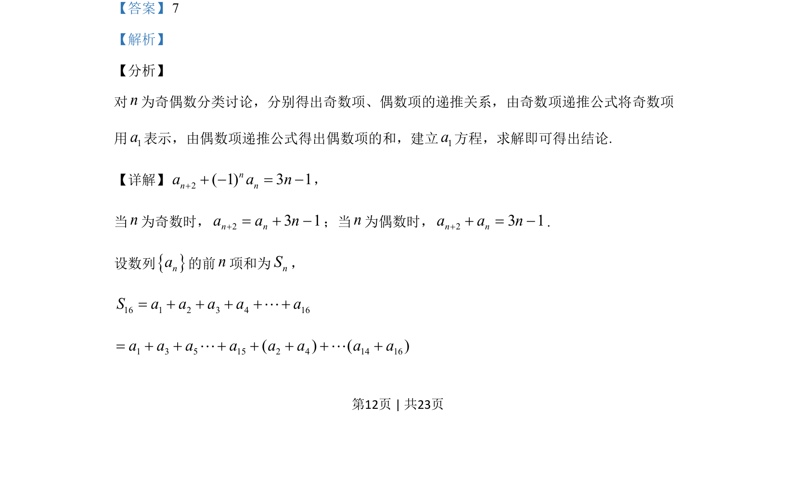
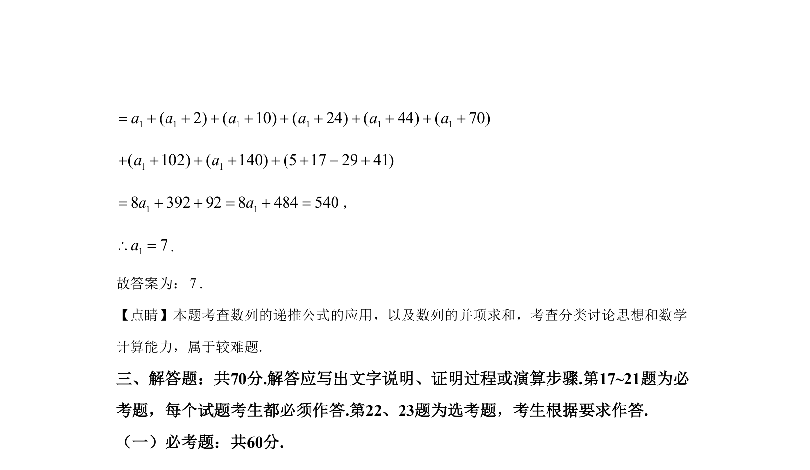

## 题面

## 摘要

考查数列递推关系，需分奇偶讨论并求和建立方程求解。

## 关联考点

- [[1382-数列递推|数列递推]]
- [[奇偶分类讨论]]
- [[355-等差数列前n项和|前n项和]]

## 答案与解析

> 📄 原 PDF 第 12 页：`素材/真题/湖南/2008-2024·（湖南）数学高考真题/2020年高考数学试卷（文）（新课标Ⅰ）（解析卷）.pdf`

<!-- 题干文本-start -->
## 题干文本
16.数列{ }na满足2( 1) 3 1nn na a n++ - = -，前16项和为540，则1a= ______________.
<!-- 题干文本-end -->

<!-- 解析文本-start -->
## 解析文本
【答案】7
【解析】
【分析】
对n为奇偶数分类讨论，分别得出奇数项、偶数项的递推关系，由奇数项递推公式将奇数项
用1a表示，由偶数项递推公式得出偶数项的和，建立1a方程，求解即可得出结论.
【详解】2( 1) 3 1nn na a n++ - = -，
当n为奇数时，23 1n na a n+= +-；当n为偶数时，23 1n na a n++ = -.
设数列{}na的前n项和为nS，
16 1 2 3 4 16S a a a a a= + + + + +L1 3 5 15 2 4 14 16( ) ( )a a a a a a a a= + + + + + + +L L
<!-- 解析文本-end -->
