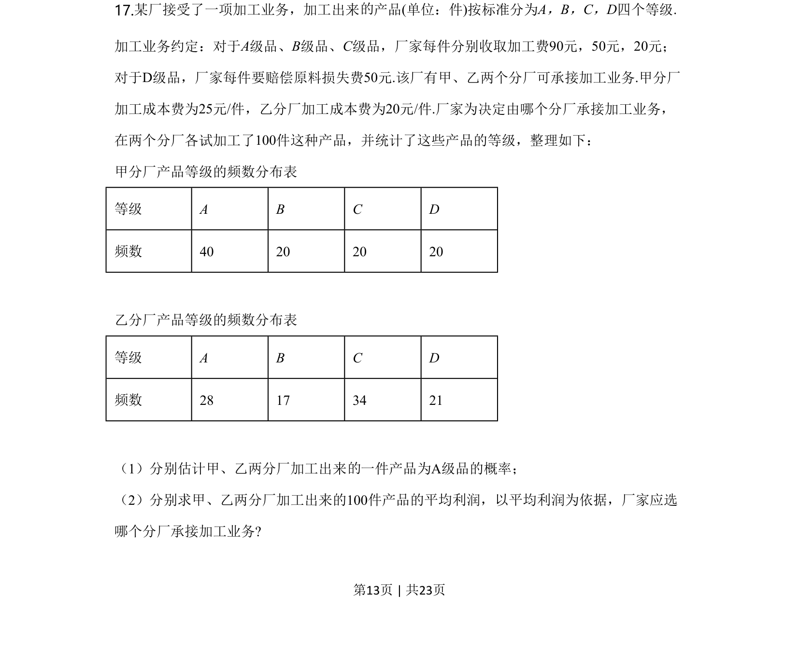
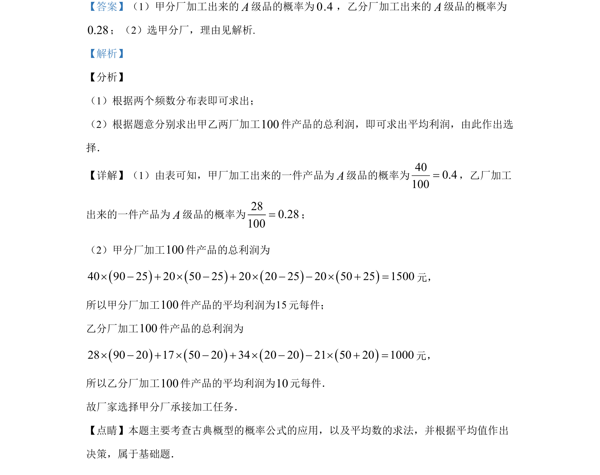

## 题面

## 摘要

根据频数分布表计算概率，求平均利润并作出决策。

## 关联考点

- [[320-古典概型|古典概型]]
- [[055-平均数|平均数]]
- [[决策]]

## 答案与解析

> 📄 原 PDF 第 13 页：`素材/真题/湖南/2008-2024·（湖南）数学高考真题/2020年高考数学试卷（文）（新课标Ⅰ）（解析卷）.pdf`

<!-- 题干文本-start -->
## 题干文本
17.某厂接受了一项加工业务，加工出来 产品 (单位：件)按标准分为A，B，C，D四个等级.
加工业务约定：对于A级品、B级品、C级品，厂家每件分别收取加工费90元，50元，20元；
对于D级品，厂家每件要赔偿原料损失费50元.该厂有甲、乙两个分厂可承接加工业务.甲分厂
加工成本费为25元/件，乙分厂加工成本费为20元/件.厂家为决定由哪个分厂承接加工业务，
在两个分厂各试加工了100件这种产品，并统计了这些产品的等级，整理如下： 
甲分厂产品等级的频数分布表
等级 A B C D
频数 40 20 20 20
乙分厂产品等级的频数分布表
等级 A B C D
频数 28 17 34 21
（1）分别估计甲、乙两分厂加工出来 一件产品为 A级品的概率；
（2）分别求甲、乙两分厂加工出来的100件产品的平均利润，以平均利润为依据，厂家应选
哪个分厂承接加工业务?
的
的
<!-- 题干文本-end -->

<!-- 解析文本-start -->
## 解析文本

<!-- 解析文本-end -->
