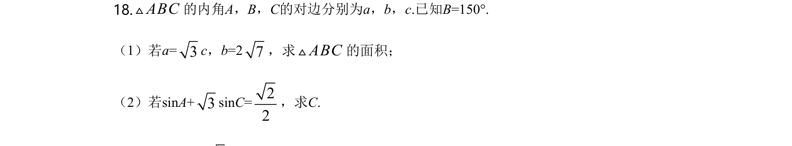
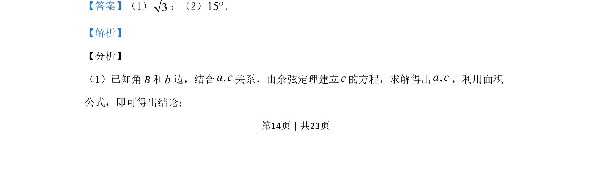
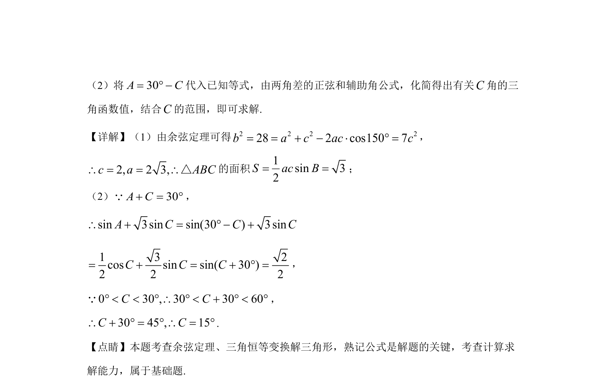

## 题面

## 摘要

已知一边一角及边关系，利用余弦定理和面积公式求边与面积；再通过三角恒等变换求角度。

## 关联考点

- [[126-定理|余弦定理]]
- [[619-三角形面积公式|三角形面积公式]]
- [[1395-两角差的正弦公式|两角差的正弦公式]]
- [[1126-辅助角公式|辅助角公式]]

## 答案与解析

> 📄 原 PDF 第 14 页：`素材/真题/湖南/2008-2024·（湖南）数学高考真题/2020年高考数学试卷（文）（新课标Ⅰ）（解析卷）.pdf`
