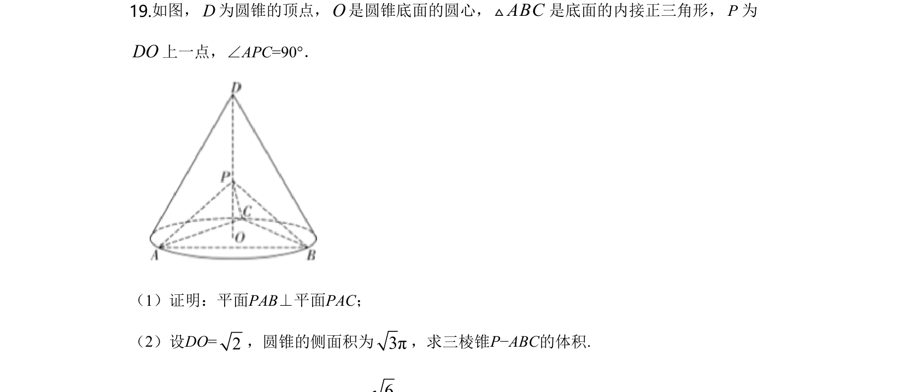
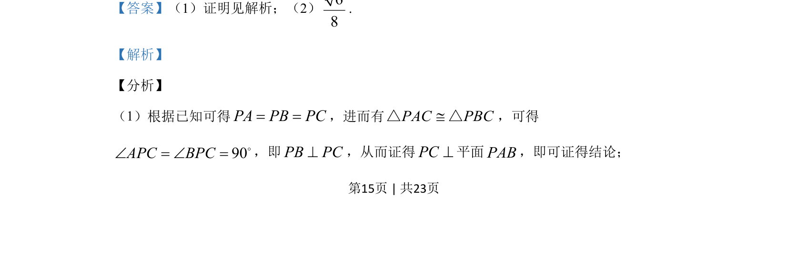
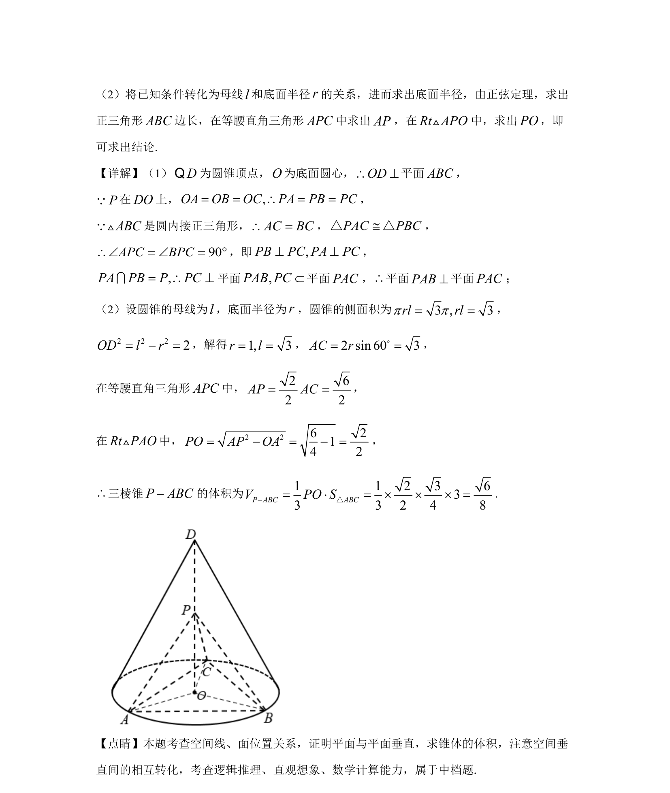

## 题面

## 摘要

考查圆锥中通过线面垂直证明面面垂直，并利用侧面积、正弦定理求几何量。

## 关联考点

- [[1085-线面垂直的判定|线面垂直的判定]]
- [[1149-面面垂直的判定|面面垂直的判定]]
- [[783-圆锥侧面积|圆锥侧面积]]
- [[126-定理|正弦定理]]

## 答案与解析

> 📄 原 PDF 第 15 页：`素材/真题/湖南/2008-2024·（湖南）数学高考真题/2020年高考数学试卷（文）（新课标Ⅰ）（解析卷）.pdf`
