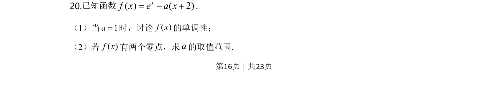
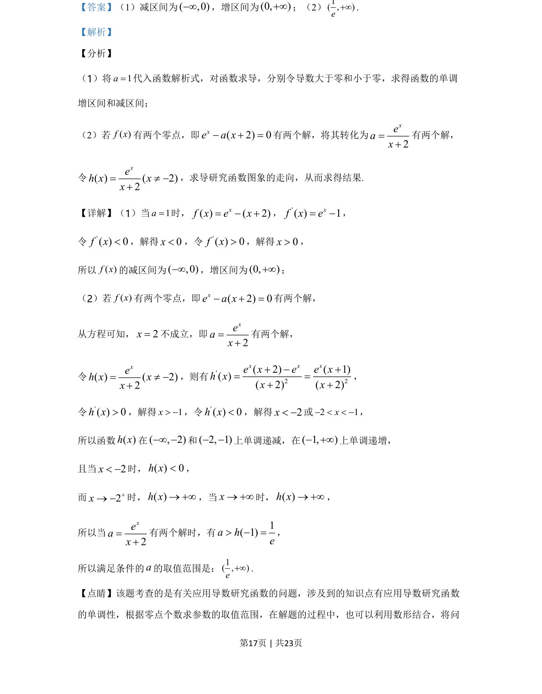
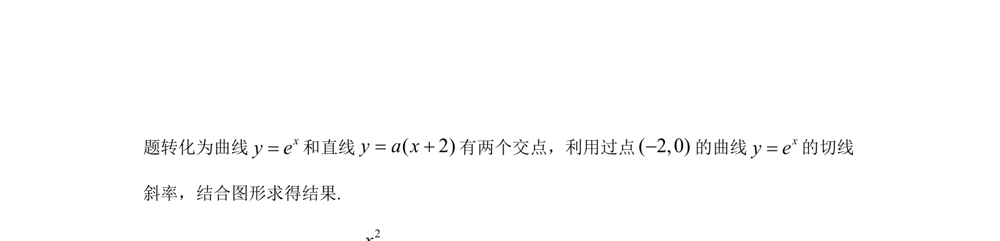

## 题面

## 摘要

研究含参函数单调性并根据零点个数求参数范围，涉及导数应用和数形结合。

## 关联考点

- [[705-利用导数研究函数的单调性|导数与单调性]]
- [[288-函数零点|函数零点]]
- [[726-参数范围|参数范围]]
- [[897-数形结合|数形结合]]

## 答案与解析

> 📄 原 PDF 第 16 页：`素材/真题/湖南/2008-2024·（湖南）数学高考真题/2020年高考数学试卷（文）（新课标Ⅰ）（解析卷）.pdf`
