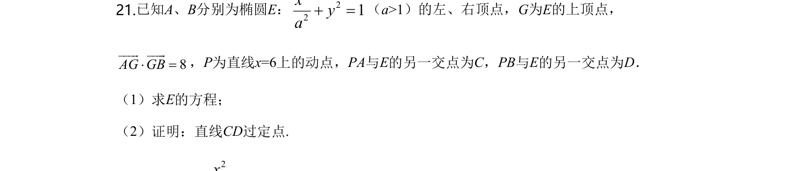
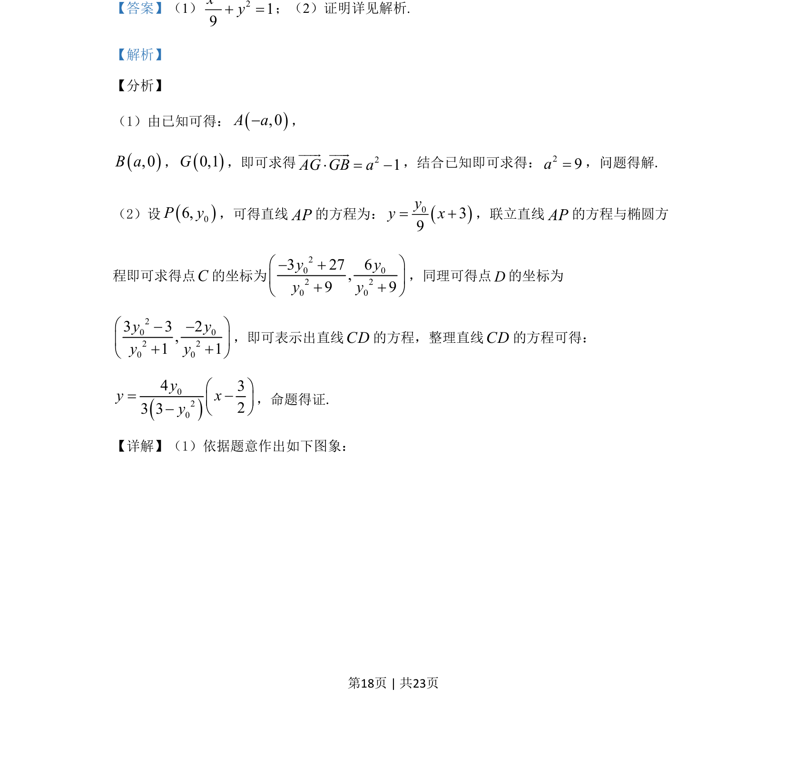
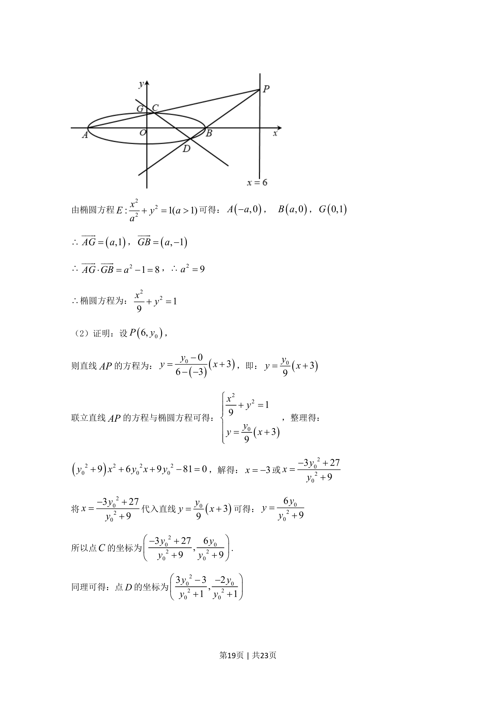
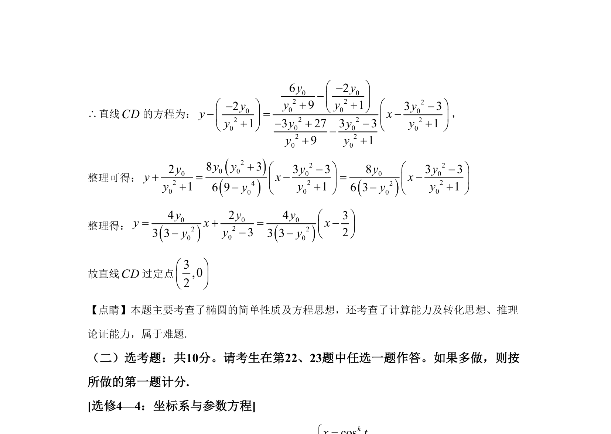

## 题面

## 摘要

椭圆方程求解及直线与椭圆交点坐标计算，证明直线过定点问题

## 关联考点

- [[941-椭圆标准方程|椭圆标准方程]]
- [[1026-直线方程|直线方程]]
- [[1391-直线与椭圆位置关系|直线与椭圆位置关系]]
- [[377-定点定值问题|定点问题]]

## 答案与解析

> 📄 原 PDF 第 18 页：`素材/真题/湖南/2008-2024·（湖南）数学高考真题/2020年高考数学试卷（文）（新课标Ⅰ）（解析卷）.pdf`
