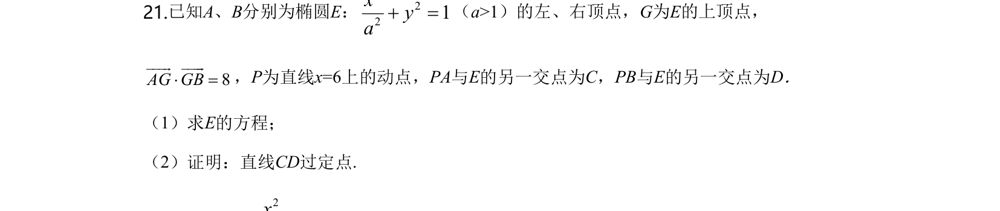
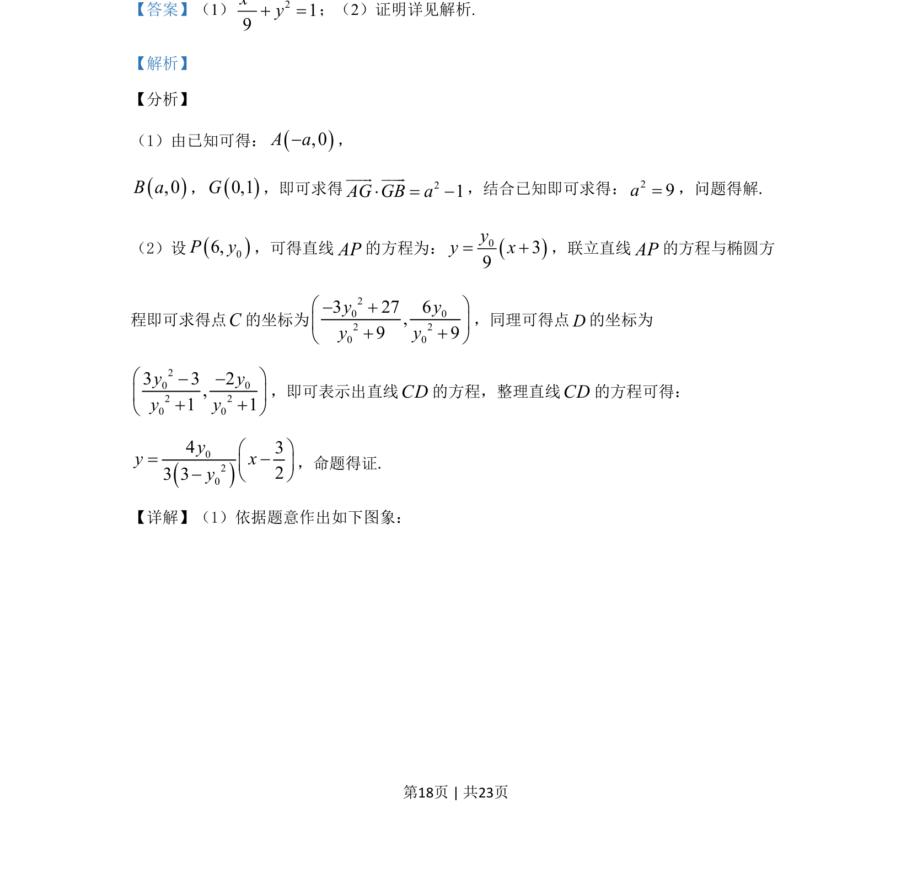
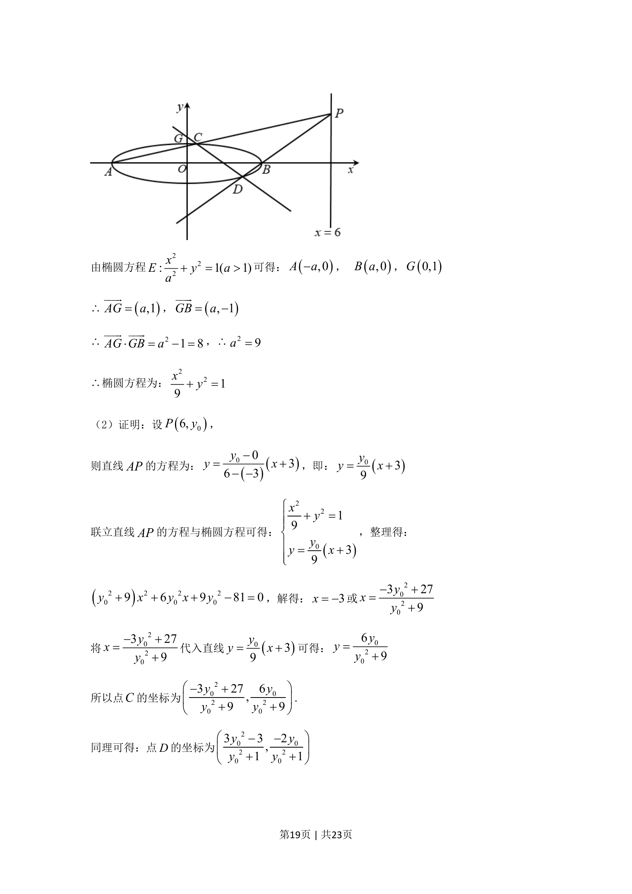
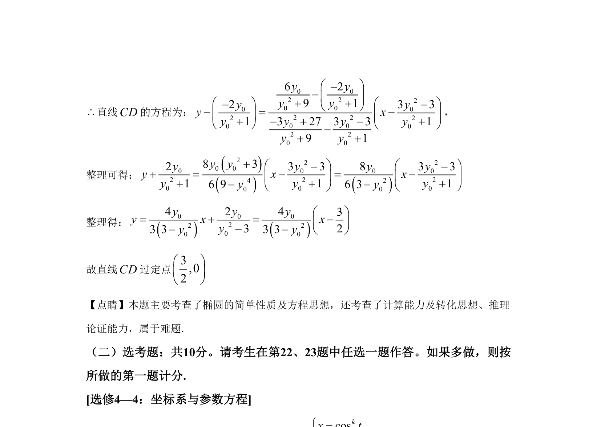

## 题面

## 摘要

椭圆方程求解及直线与椭圆交点坐标计算，证明直线过定点问题

## 关联考点

- [[941-椭圆标准方程|椭圆标准方程]]
- [[1026-直线方程|直线方程]]
- [[1391-直线与椭圆位置关系|直线与椭圆位置关系]]
- [[377-定点定值问题|定点问题]]

## 答案与解析

> 📄 原 PDF 第 18 页：`素材/真题/湖南/2008-2024·（湖南）数学高考真题/2020年高考数学试卷（文）（新课标Ⅰ）（解析卷）.pdf`

<!-- 题干文本-start -->
## 题干文本
21.已知A、B分别为椭圆E：
2221xya+ =（a>1）的左、右顶点，G为E的上顶点，
8AG GB× =uuur uuu r，P为直线x=6上的动点，PA与E的另一交点为C，PB与E的另一交点为D．
（1）求E的方程；
（2）证明：直线CD过定点.
<!-- 题干文本-end -->

<!-- 解析文本-start -->
## 解析文本
【答案】（1）
2219xy+ =；（2）证明详见解析.
【解析】
【分析】
（1）由已知可得：,0A a-， 
,0B a，0,1G，即可求得 21AG GB a× = -uuu r uuu r
，结合已知即可求得：29a=，问题得解.
（2）设06,P y，可得直线AP的方程为：039yy x= +，联立直线AP的方程与椭圆方
程即可求得点C的坐标为
20 02 20 03 27 6,9 9y yy yæ ö- +ç ÷+ +è ø
，同理可得点D的坐标为
20 02 20 03 3 2,1 1y yy yæ ö- -ç ÷+ +è ø
，即可表示出直线CD的方程，整理直线CD的方程可得：
0204323 3yy xyæ ö= -ç ÷-è ø，命题得证.
【详解】（1）依据题意作出如下图象：
<!-- 解析文本-end -->
