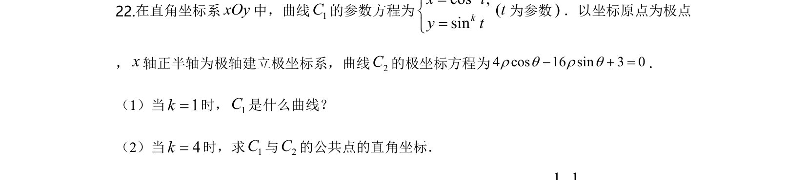
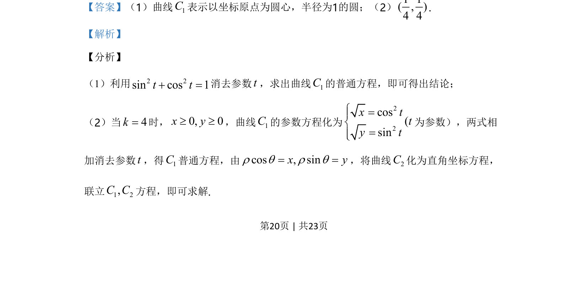
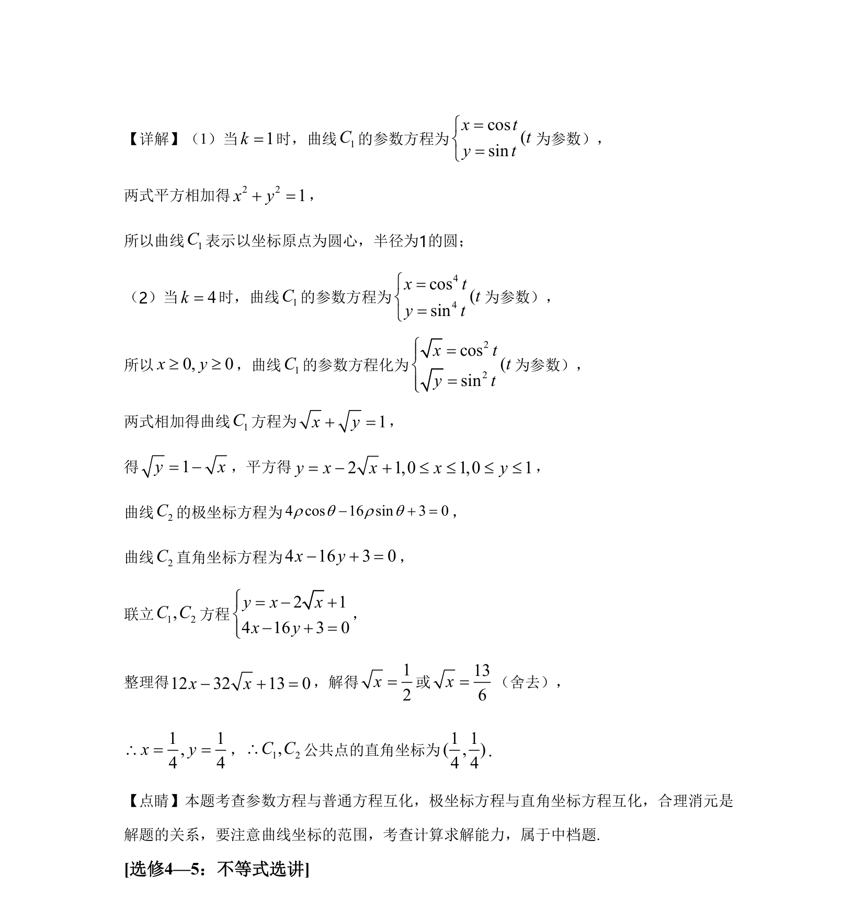

## 题面

## 摘要

考查参数方程与极坐标方程的互化，联立曲线方程求交点坐标。

## 关联考点

- [[061-方程|参数方程]]
- [[921-极坐标方程|极坐标方程]]
- [[910-曲线交点|曲线交点]]

## 答案与解析

> 📄 原 PDF 第 20 页：`素材/真题/湖南/2008-2024·（湖南）数学高考真题/2020年高考数学试卷（文）（新课标Ⅰ）（解析卷）.pdf`

<!-- 题干文本-start -->
## 题干文本
22.在直角坐标系xOy中，曲线1C的参数方程为
cos ,sinkkx ty tì=í=î(t为参数)．以坐标原点为极点
，x轴正半轴为极轴建立极坐标系，曲线2C的极坐标方程为4 cos 16 sin 3 0r q r q- + =．
（1）当1k=时，1C是什么曲线？
（2）当4k=时，求1C与2C的公共点的直角坐标．
<!-- 题干文本-end -->

<!-- 解析文本-start -->
## 解析文本
【答案】（1）曲线1C表示以坐标原点为圆心，半径为1的圆；（2）1 1( , )4 4.
【解析】
【分析】
（1）利用2 2sin cos 1t t+ =消去参数t，求出曲线1C的普通方程，即可得出结论；
（2）当4k=时，0, 0x y³ ³，曲线1C的参数方程化为
22cos(sinx tty tì=ïí=ïî
为参数），两式相
加消去参数t，得1C普通方程，由cos , sinx yr q r q= =，将曲线2C化为直角坐标方程，
联立1 2,C C方程，即可求解.
<!-- 解析文本-end -->
