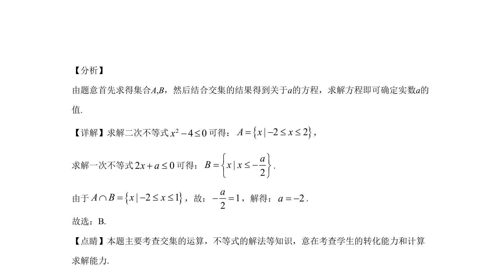

## 题面

## 摘要

本题通过解不等式确定集合，利用交集结果求参数值。

## 关联考点

- [[1139-集合的交集|集合的交集]]
- [[267-一元二次不等式|一元二次不等式]]
- [[114-一元一次不等式|一元一次不等式]]

## 答案与解析

> 📄 原 PDF 第 1 页：`素材/真题/湖南/2008-2024·（湖南）数学高考真题/2020年高考数学试卷（理）（新课标Ⅰ）（解析卷）.pdf`
