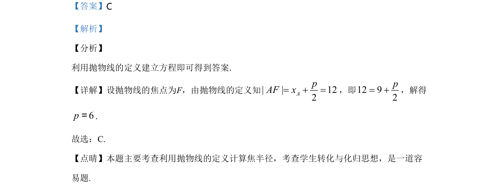

## 题面

## 摘要

利用抛物线定义通过焦半径计算参数p，属于基础概念应用题。

## 关联考点

- [[878-抛物线的定义|抛物线的定义]]
- [[1168-焦半径|焦半径]]
- [[061-方程|方程求解]]

## 答案与解析

> 📄 原 PDF 第 3 页：`素材/真题/湖南/2008-2024·（湖南）数学高考真题/2020年高考数学试卷（理）（新课标Ⅰ）（解析卷）.pdf`
