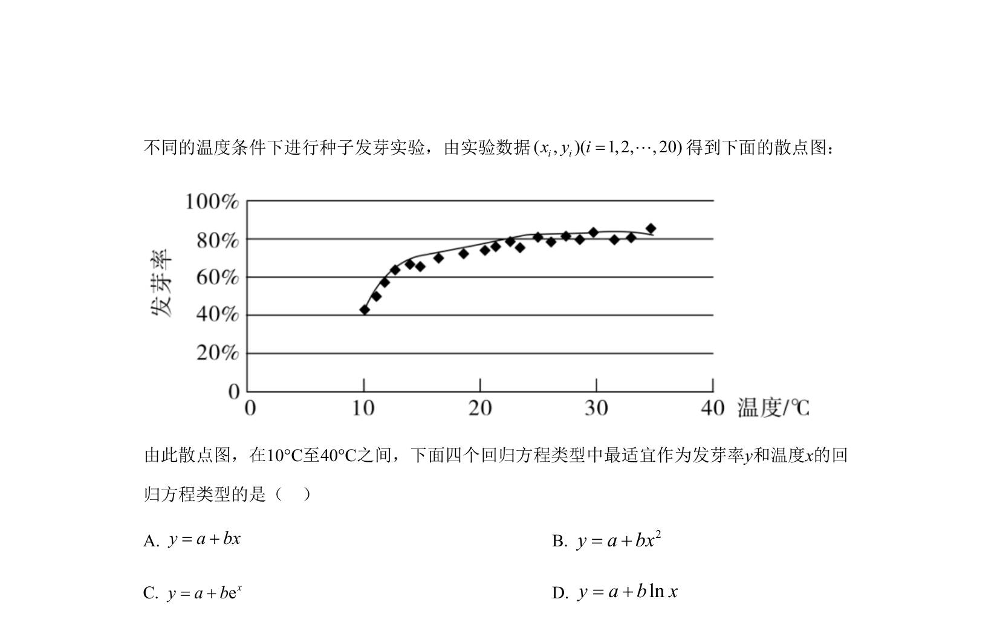
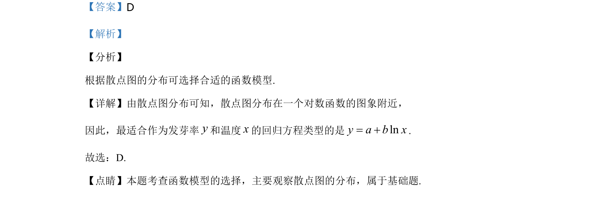

## 题面

## 摘要

根据散点图分布选择函数模型，确定对数回归方程类型。

## 关联考点

- [[488-散点图|散点图]]
- [[506-经验回归方程|回归方程]]
- [[298-对数函数|对数函数]]

## 答案与解析

> 📄 原 PDF 第 3 页：`素材/真题/湖南/2008-2024·（湖南）数学高考真题/2020年高考数学试卷（理）（新课标Ⅰ）（解析卷）.pdf`
