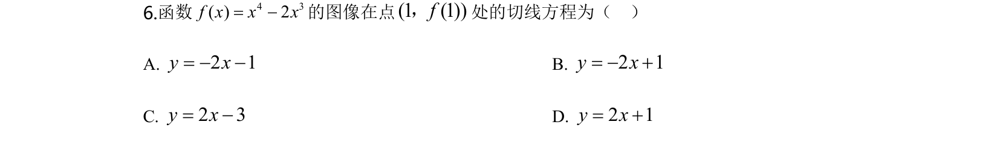
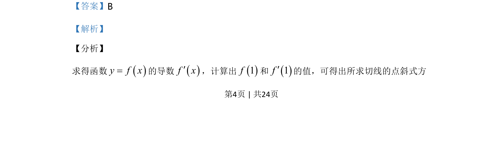
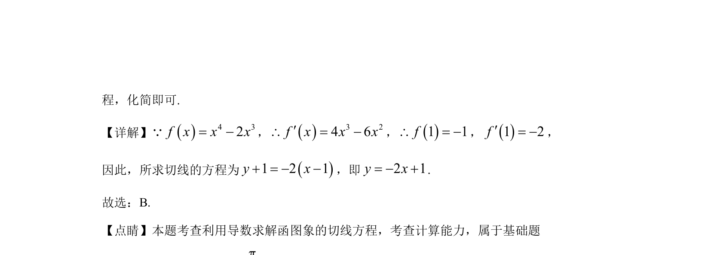

## 题面

## 摘要

求函数在某点处的切线方程，使用导数求斜率，写出点斜式并化简。

## 关联考点

- [[440-导数的几何意义|导数的几何意义]]
- [[422-切线方程|切线方程]]
- [[427-多项式函数导数|多项式求导]]

## 答案与解析

> 📄 原 PDF 第 4 页：`素材/真题/湖南/2008-2024·（湖南）数学高考真题/2020年高考数学试卷（理）（新课标Ⅰ）（解析卷）.pdf`
