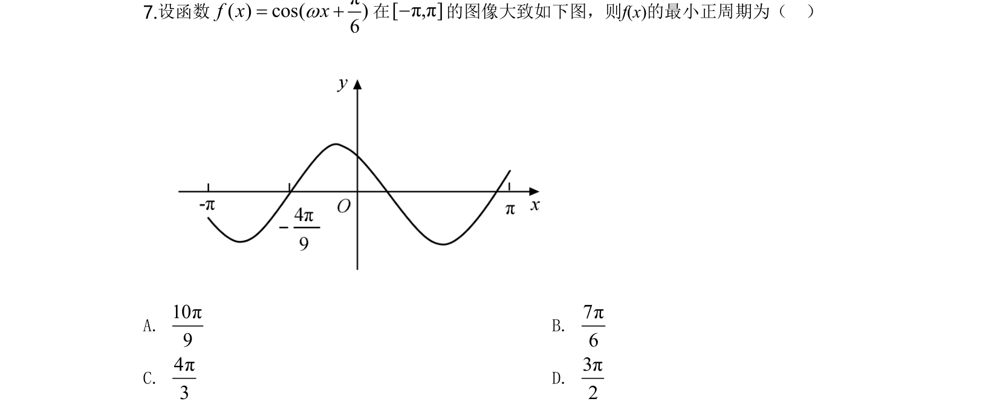
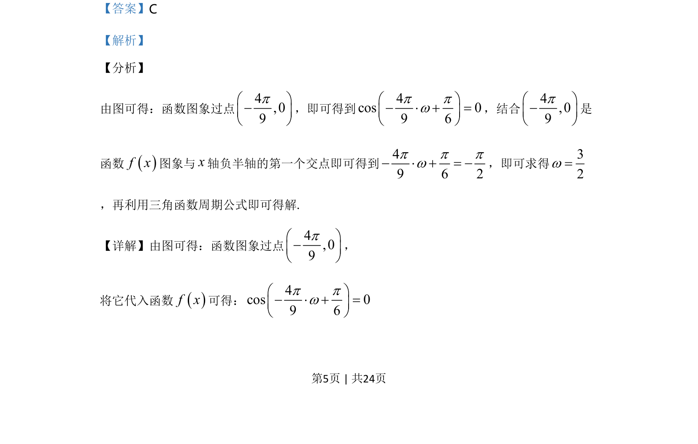
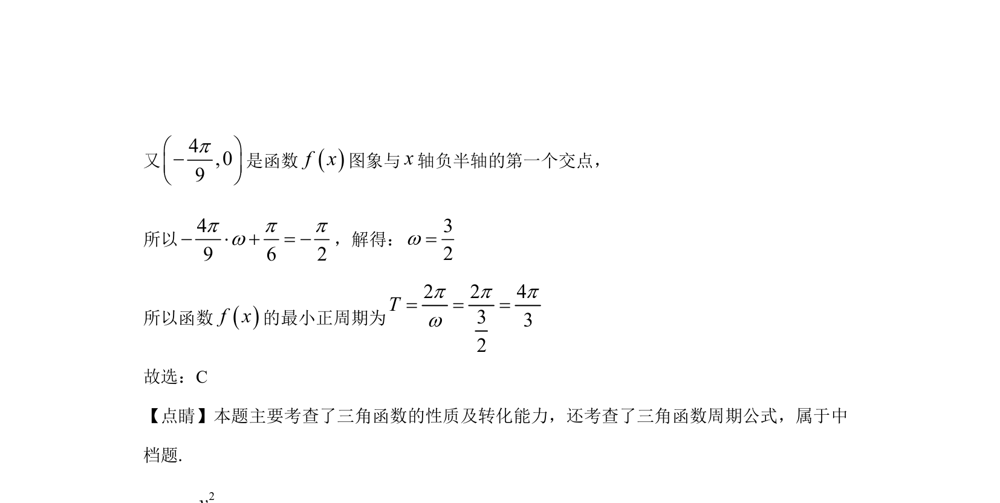

## 题面

## 摘要

根据三角函数的图象与x轴交点求解参数w，并利用周期公式完成计算。

## 关联考点

- [[614-三角函数的图象与性质|三角函数的图象与性质]]
- [[998-由图象求解析式|由图象求解析式]]
- [[276-余弦函数图象与性质|余弦函数]]
- [[761-周期性|周期性]]

## 答案与解析

> 📄 原 PDF 第 5 页：`素材/真题/湖南/2008-2024·（湖南）数学高考真题/2020年高考数学试卷（理）（新课标Ⅰ）（解析卷）.pdf`
