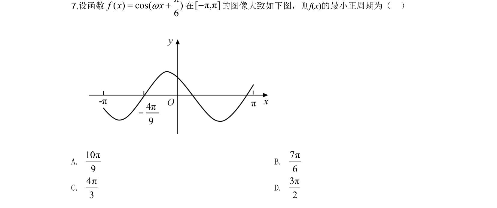
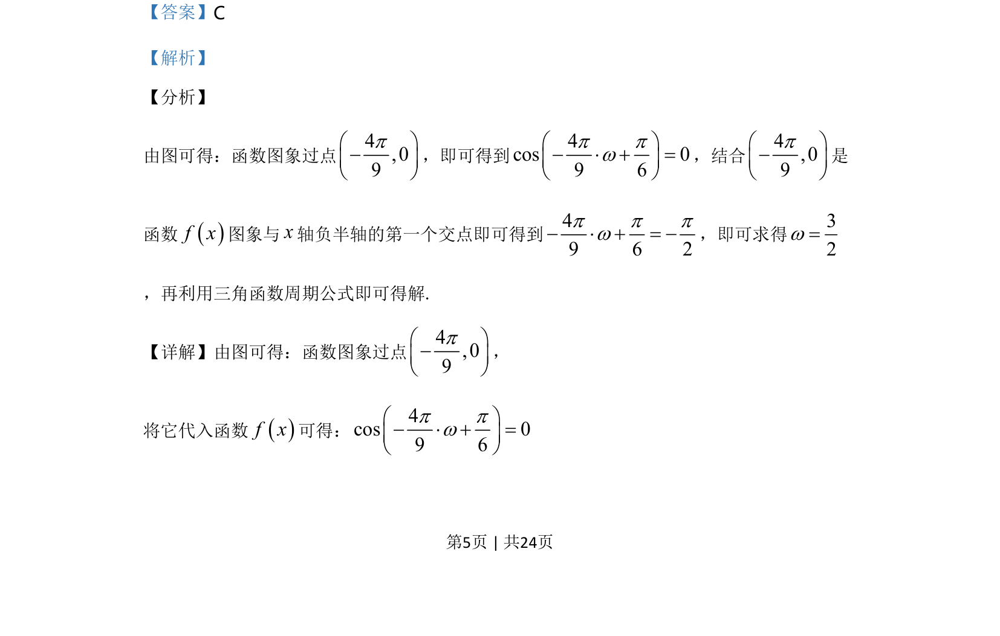
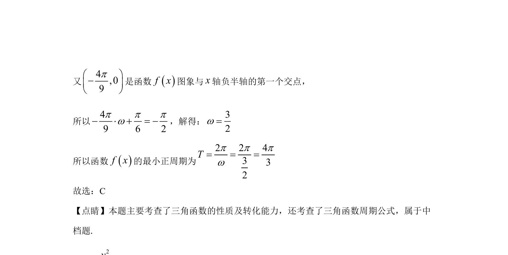

## 题面

## 摘要

根据三角函数的图象与x轴交点求解参数w，并利用周期公式完成计算。

## 关联考点

- [[612-三角函数的图像与性质|三角函数的图象与性质]]
- [[998-由图象求解析式|由图象求解析式]]
- [[276-余弦函数图象与性质|余弦函数]]
- [[761-周期性|周期性]]

## 答案与解析

> 📄 原 PDF 第 5 页：`素材/真题/湖南/2008-2024·（湖南）数学高考真题/2020年高考数学试卷（理）（新课标Ⅰ）（解析卷）.pdf`

<!-- 题干文本-start -->
## 题干文本
7.设函数( ) cosπ( )6f x xw= +在[π,π]-的图像大致如下图，则f(x)的最小正周期为（    ）
A. 10π9
B. 7π6
C. 4π3
D. 3π2
<!-- 题干文本-end -->

<!-- 解析文本-start -->
## 解析文本
【答案】C
【解析】
【分析】
由图可得：函数图象过点
4,09pæ ö-ç ÷è ø
，即可得到
4cos 09 6p pwæ ö- × + =ç ÷è ø
，结合
4,09pæ ö-ç ÷è ø
是
函数f x图象与x轴负半轴的第一个交点即可得到49 6 2p p pw- × + = -，即可求得32w=
，再利用三角函数周期公式即可得解.
【详解】由图可得：函数图象过点
4,09pæ ö-ç ÷è ø
，
将它代入函数f x可得：
4cos 09 6p pwæ ö- × + =ç ÷è ø
<!-- 解析文本-end -->
