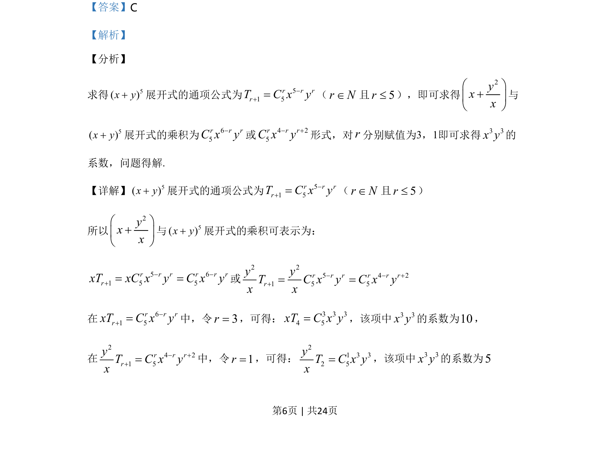
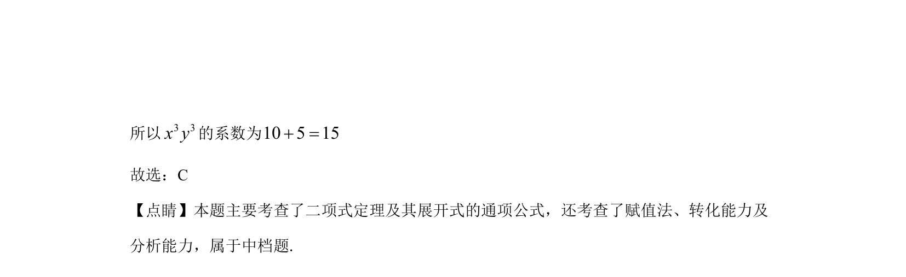

## 题面

## 摘要

求二项展开式特定项系数，涉及乘法分配与通项公式赋值。

## 关联考点

- [[472-二项式定理|二项式定理]]
- [[1160-展开式通项|展开式通项]]
- [[特定项系数]]

## 答案与解析

> 📄 原 PDF 第 6 页：`素材/真题/湖南/2008-2024·（湖南）数学高考真题/2020年高考数学试卷（理）（新课标Ⅰ）（解析卷）.pdf`

<!-- 题干文本-start -->
## 题干文本
8.
25( )( )x xyxy+ +的展开式中x3y3的系数为（    ）
A. 5 B. 10
C. 15 D. 20
<!-- 题干文本-end -->

<!-- 解析文本-start -->
## 解析文本
【答案】C
【解析】
【分析】
求得 5( )x y+展开式的通项公式为 51 5r r rrT C x y-+=（r NÎ且5r£），即可求得
2yxxæ ö+ç ÷è ø
与
5( )x y+展开式的乘积为65r r rC x y-或4 25r r rC x y- +形式，对r分别赋值为3，1即可求得3 3x y的
系数，问题得解.
【详解】 5( )x y+展开式的通项公式为 51 5r r rrT C x y-+=（r NÎ且5r£）
所以
2yxxæ ö+ç ÷è ø
与 5( )x y+展开式的乘积可表示为：
5 61 5 5r r r r r rrxT xC x y C x y- -+= =或
2 25 4 21 5 5r r r r r rrT C x yxC yy yxx- - ++= =
在 61 5r r rrxT C x y-+=中，令3r=，可得： 3 3 34 5xT C x y=，该项中3 3x y的系数为10，
在 4 21 52r r rrT C xxyy- ++=中，令1r=，可得： 521 3 32T Cyxxy=，该项中3 3x y的系数为5
<!-- 解析文本-end -->
