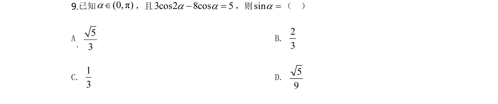
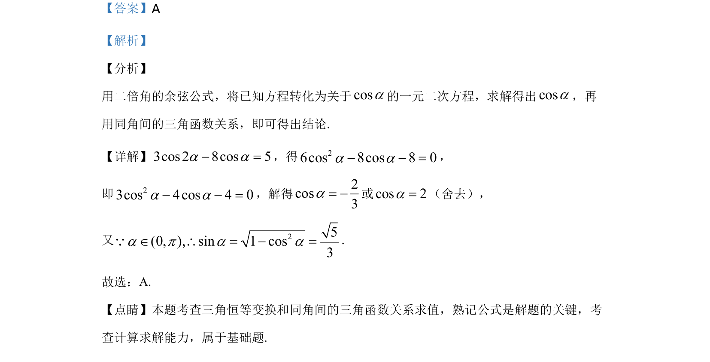

## 题面

## 摘要

本题考查利用二倍角余弦公式化简方程，并结合同角三角函数关系求值。

## 关联考点

- [[二倍角余弦公式]]
- [[741-同角三角函数基本关系|同角三角函数基本关系]]
- [[1107-解一元二次方程|解一元二次方程]]

## 答案与解析

> 📄 原 PDF 第 7 页：`素材/真题/湖南/2008-2024·（湖南）数学高考真题/2020年高考数学试卷（理）（新课标Ⅰ）（解析卷）.pdf`
