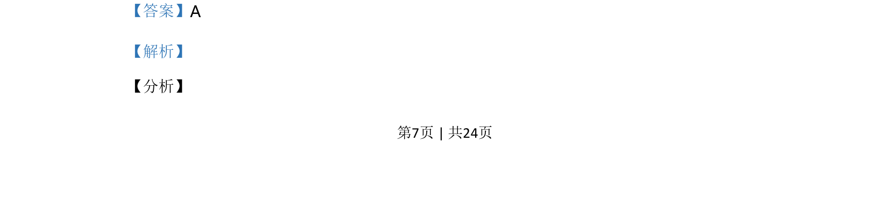
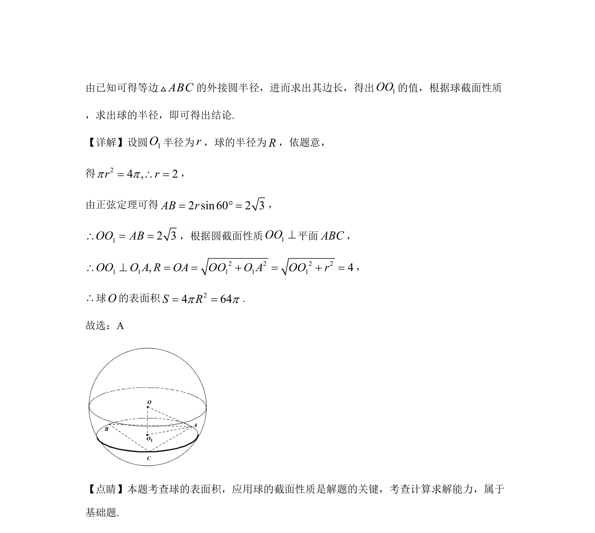

## 题面

## 摘要

求球的表面积，利用正弦定理和球的截面性质建立方程求解

## 关联考点

- [[993-球的表面积|球的表面积]]
- [[126-定理|正弦定理]]
- [[1415-球的截面性质|球的截面性质]]

## 答案与解析

> 📄 原 PDF 第 7 页：`素材/真题/湖南/2008-2024·（湖南）数学高考真题/2020年高考数学试卷（理）（新课标Ⅰ）（解析卷）.pdf`
