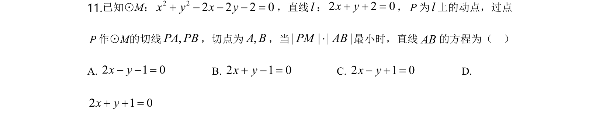
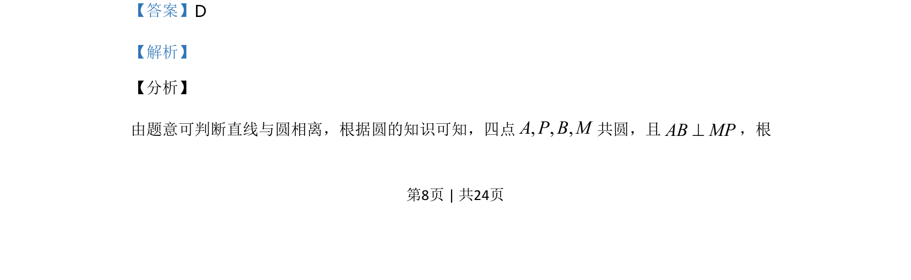
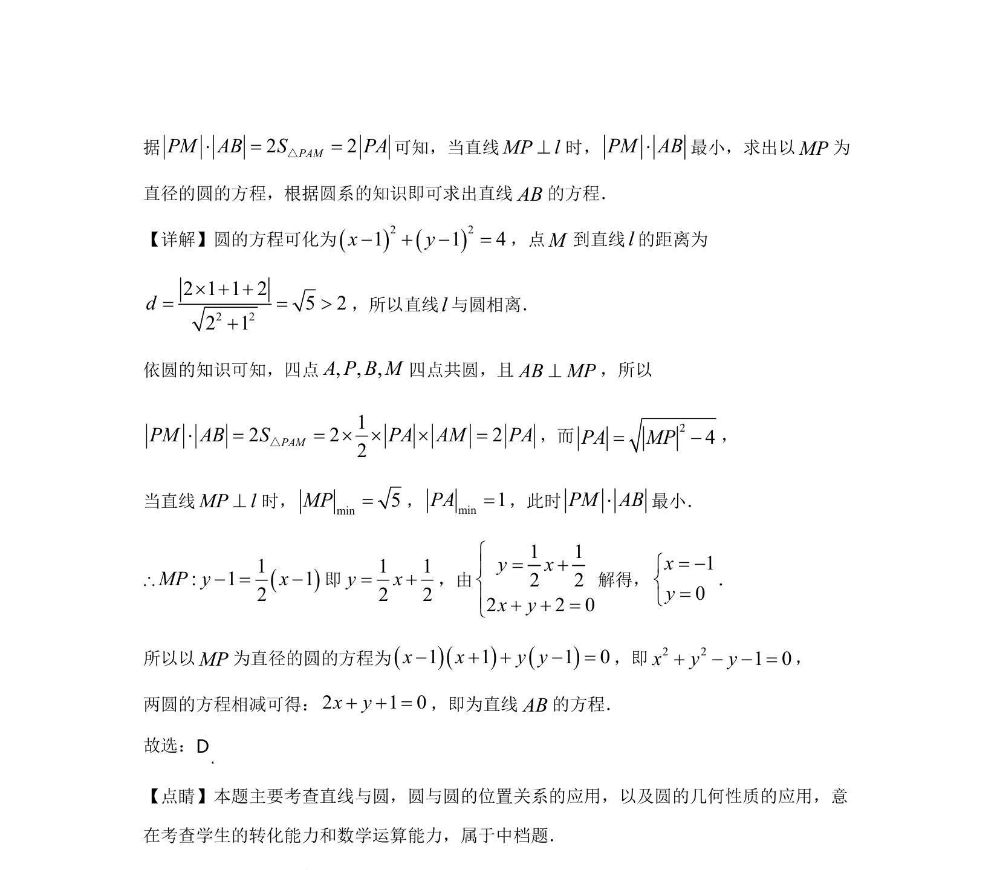

## 题面

## 摘要

考查直线与圆的位置关系、四点共圆性质及利用几何意义求最小值并求直线方程。

## 关联考点

- [[394-直线和圆位置关系-高中|直线与圆的位置关系]]
- [[766-四点共圆|四点共圆]]
- [[777-圆的几何性质|圆的几何性质]]
- [[896-数学运算|数学运算]]

## 答案与解析

> 📄 原 PDF 第 8 页：`素材/真题/湖南/2008-2024·（湖南）数学高考真题/2020年高考数学试卷（理）（新课标Ⅰ）（解析卷）.pdf`
