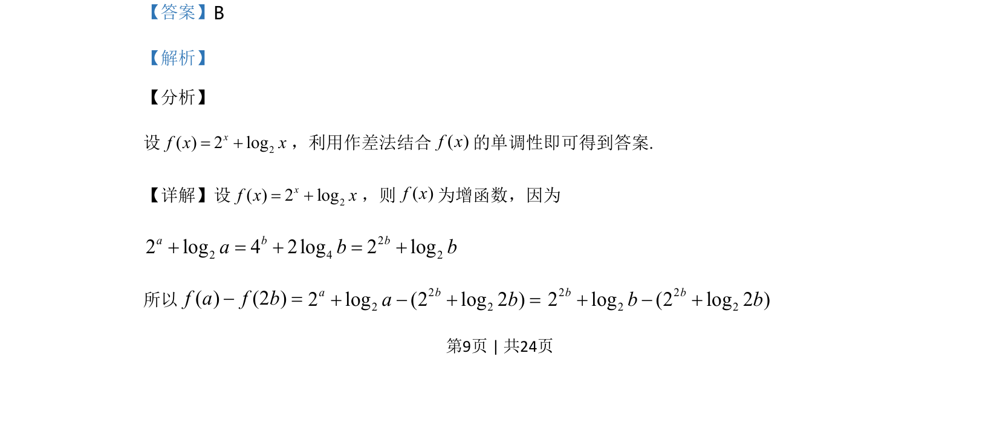
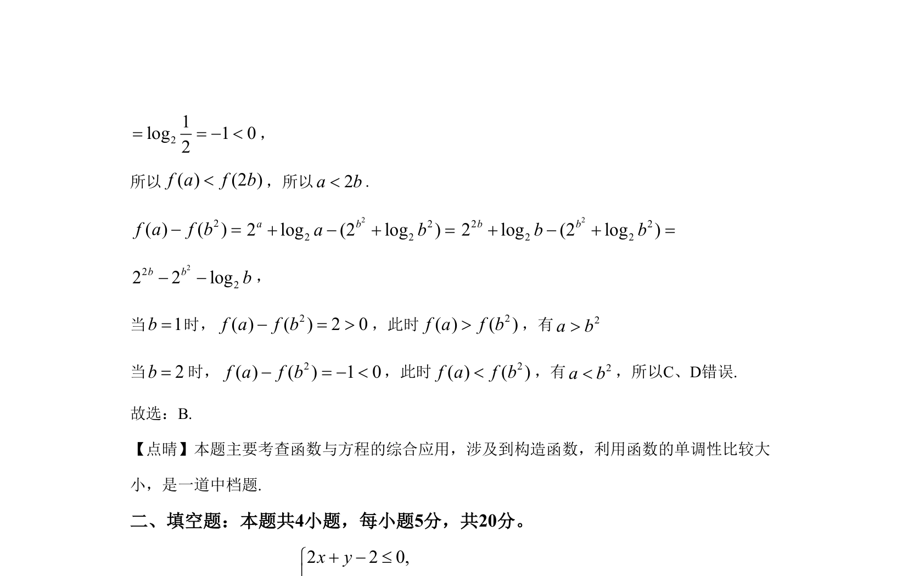

## 题面

## 摘要

构造函数利用单调性比较代数式大小

## 关联考点

- [[函数单调性应用]]
- [[832-对数运算|对数运算]]
- [[构造函数法]]
- [[622-不等式比较|不等式比较]]

## 答案与解析

> 📄 原 PDF 第 9 页：`素材/真题/湖南/2008-2024·（湖南）数学高考真题/2020年高考数学试卷（理）（新课标Ⅰ）（解析卷）.pdf`
